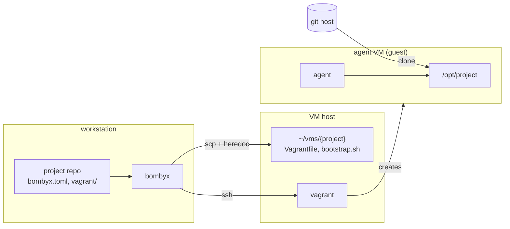
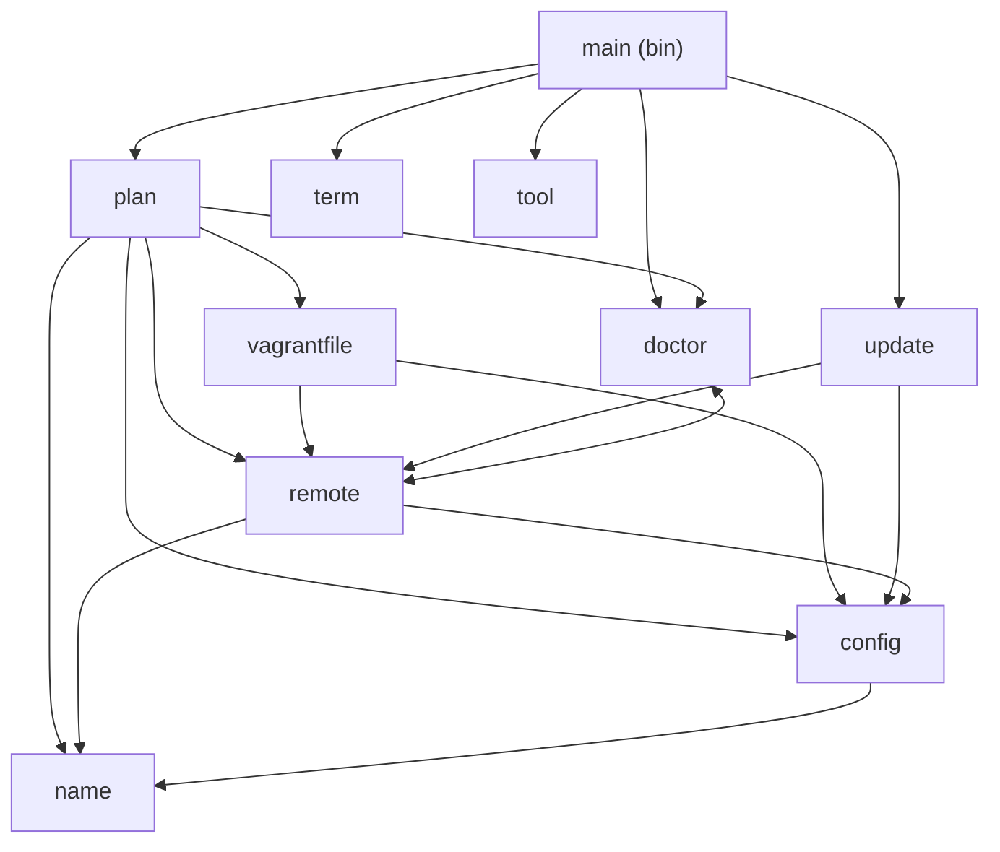
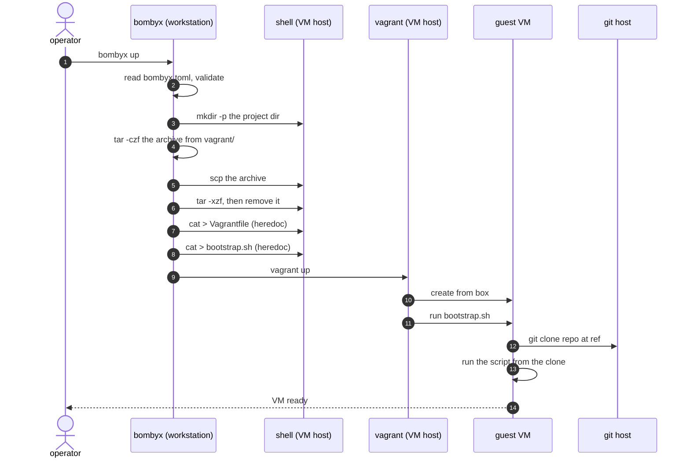
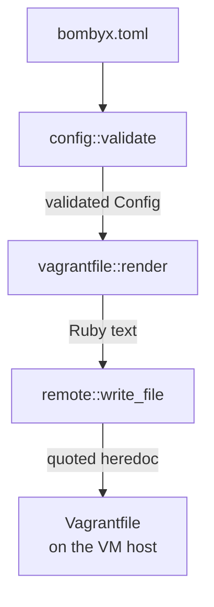

# Architecture

bombyx runs `vagrant` on a remote VM host over SSH, so an agent
works inside a VM and the workstation stays clean. It composes
`ssh`, `scp`, `tar` and `vagrant` and reimplements none of them.

> The diagrams are Mermaid, which GitHub renders in place. They
> were not previewed while being written: this workstation has
> no renderer, so the first real check is this page on GitHub.

## The three machines

The workstation never runs project code. The VM host runs
`vagrant` and holds a directory per project. The guest is the
only machine that clones the repository.

`docs/trust-boundary.md` records which machines are allowed to
hold project source, and what is still unfinished.

## Library modules

Everything with a decision in it lives in the library, because
`src/bin/` is outside the coverage gate.

`doctor` and `remote` reference each other: `remote` builds the
probe commands, `doctor` decides what their output means.

| Module | Owns |
|--------|------|
| `plan` | which commands run, and in what order |
| `config` | `bombyx.toml`, host resolution, every field rule |
| `config::vm` | `[vm]`, `[source]`, and their guards |
| `vagrantfile` | rendering the Vagrantfile and the bootstrap |
| `remote` | building `ssh`/`scp`/`tar` argv, quoting |
| `remote::write` | the heredoc that writes a generated file |
| `doctor` | preconditions, and what a result means |
| `update` | `self-update`: download, verify, swap |
| `name` | scratch-VM names, and path segments |
| `term` | line endings, per stream |
| `tool` | resolving a program, never via the cwd |

`main` parses arguments, spawns processes and prints. Nothing
else.

## `bombyx up`, end to end

Two things about the order. The generated files land **after**
the archive is unpacked, or the push would overwrite them. And
`vagrant` runs last, because it reads the Vagrantfile.

`provision` is the same sequence ending in `vagrant provision`,
which exists because vagrant runs provisioners only when it
first creates a machine.

## Where the rules live

A rule goes in the module that owns the value, not at each call
site.

Each stage is safe on its own. `validate` refuses what breaks
Ruby, what `git` reads as an option, and paths leaving the
clone. `render` escapes Ruby anyway. `write_file` lengthens its
heredoc delimiter until no payload line equals it, rather than
trusting either. A guard in another module is the one a new
field gets added without.

## Quality gates

`cargo xtask validate` runs nine, cheapest first: dependency
cooldown, formatting, duplication, licences, clippy, doc links,
tests, coverage, security audit. `CLAUDE.md` has the detail,
including why `audit` degrades to a warning inside `validate`
and errors when run alone.
