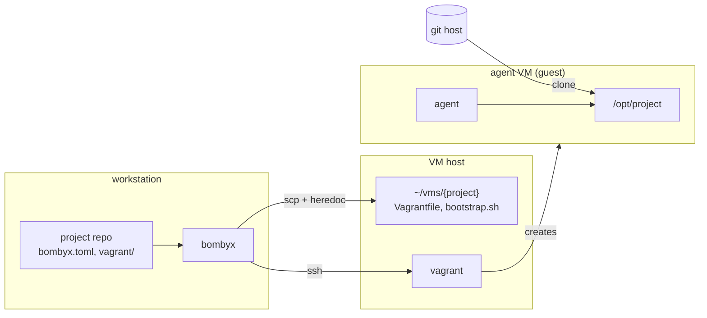
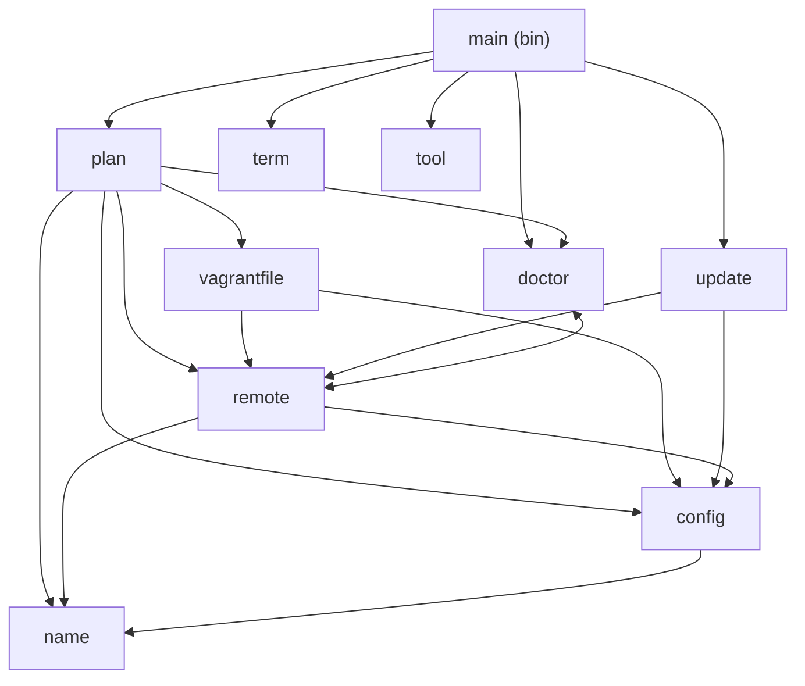
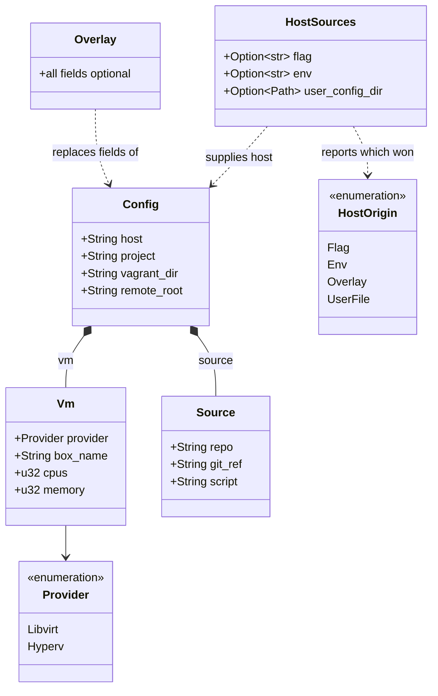
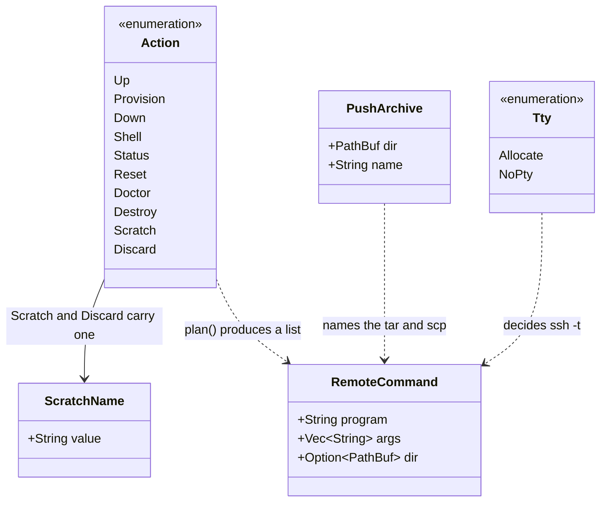
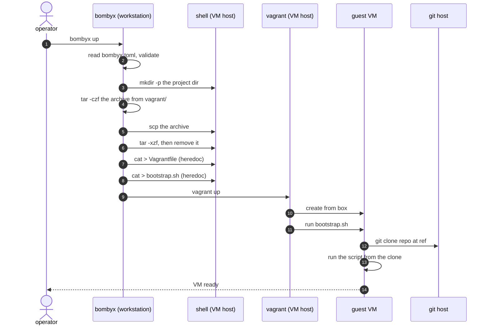
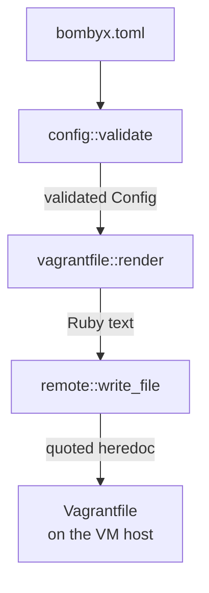

# Architecture

bombyx runs `vagrant` on a remote VM host over SSH, so an agent
works inside a VM and the workstation stays clean. It composes
`ssh`, `scp`, `tar` and `vagrant` and reimplements none of them.

## The three machines

The workstation never runs project code. The VM host runs
`vagrant` and holds a directory per project. The guest is the
only machine that clones the repository.

The diagram shows today, not the target. The `project repo`
box and the arrow leaving it are what the design is working to
remove: the goal is that neither the workstation nor the VM
host reads **any** file from the project's repo, `bombyx.toml`
and `vagrant/` included. Both still do.
`docs/trust-boundary.md` has the reasoning and the remaining
steps.

## Library modules

Everything with a decision in it lives in the library, because
`src/bin/` is outside the coverage gate.

`doctor` and `remote` reference each other: `remote` builds the
probe commands, `doctor` decides what their output means.

| Module | Owns |
|--------|------|
| `plan` | which commands run, and in what order |
| `config` | `bombyx.toml`, host resolution, every field rule |
| `config::vm` | `[vm]`, `[source]`, and their guards |
| `vagrantfile` | rendering the Vagrantfile and the bootstrap |
| `remote` | building `ssh`/`scp`/`tar` argv, quoting |
| `remote::write` | the heredoc that writes a generated file |
| `doctor` | preconditions, and what a result means |
| `update` | `self-update`: download, verify, swap |
| `name` | scratch-VM names, and path segments |
| `term` | line endings, per stream |
| `tool` | resolving a program, never via the cwd |

`main` parses arguments, spawns processes and prints. Nothing
else.

## Domain entities

What a project declares:

`Config` is what bombyx runs with. `host` is the one field never
read from `bombyx.toml`, because a VM host belongs to a person
rather than a project.

Two Rust names differ from their TOML keys, because `box` and
`ref` are Rust keywords: `box_name` is `box`, and `git_ref` is
`ref`.

What bombyx does with it:

`plan()` turns one `Action` and a `Config` into an ordered
`Vec<RemoteCommand>`, and nothing else in the library spawns a
process. That is what makes `--dry-run` honest and the ordering
testable.

`Scratch` and `Discard` carry a `ScratchName`, which is a
validated newtype rather than a `String`: it must be one path
segment, so a name that would escape the scratch directory
cannot reach `plan()` at all.

## `bombyx up`, end to end

Two things about the order. The generated files land **after**
the archive is unpacked, or the push would overwrite them. And
`vagrant` runs last, because it reads the Vagrantfile.

`provision` is the same sequence ending in `vagrant provision`,
which exists because vagrant runs provisioners only when it
first creates a machine.

## What config values are checked

`bombyx.toml` travels inside a repo, so its values are treated
as hostile input. Six reach the generated files.

| Field | Refused | Because |
|-------|---------|---------|
| `box` `repo` `ref` `script` | empty or blank | no meaning when blank |
| `box` `repo` `ref` `script` | control characters | end the line in a Ruby file |
| `box` `repo` `ref` `script` | `"` or `\` | end or escape the Ruby literal |
| `box` `repo` `ref` `script` | `#{` | Ruby interpolation is evaluated |
| `repo` `ref` `script` | leading `-` | `git` reads it as an option |
| `repo` | anything but an `https` `http` `ssh` `git` URL, or `user@host:path` | `ext::` and the other remote helpers run a command instead of cloning |
| `script` | leading `/` or `\`, a `..` segment, surrounding space | it is made executable and run as root inside the clone |
| `cpus` `memory` | zero | vagrant would refuse it on the VM host, after the push changed state |

The older fields have their own rules, in the same place:
`project` must be one path segment, `vagrant_dir` must stay
inside the project, and `remote_root` must be anchored and
several directories deep, because bombyx runs `rm -rf` on a path
derived from it.

## Why three stages and not one

Each stage is safe on its own rather than trusting the one
before it. `render` escapes every `"`, `\` and `#` even though
`validate` already refused them. `write_file` lengthens its
heredoc delimiter until no payload line equals it, rather than
assuming the payload came from `render`.

The repetition is not redundant. `Config`'s fields are public
and both functions are public, so a library caller reaches them
without passing through `validate` at all. A guard that lives in
another module is the one a new field gets added without.

## Quality gates

`cargo xtask validate` runs nine, cheapest first: dependency
cooldown, formatting, duplication, licences, clippy, doc links,
tests, coverage, security audit. `CLAUDE.md` has the detail,
including why `audit` degrades to a warning inside `validate`
and errors when run alone.
