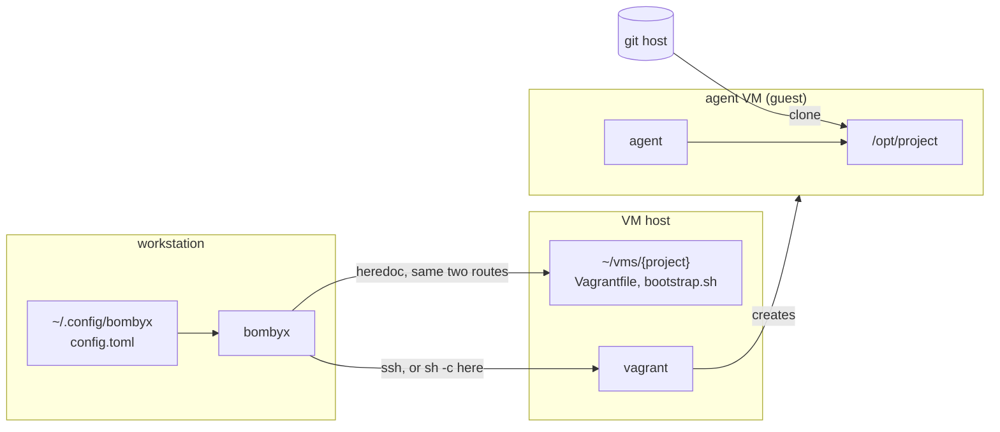
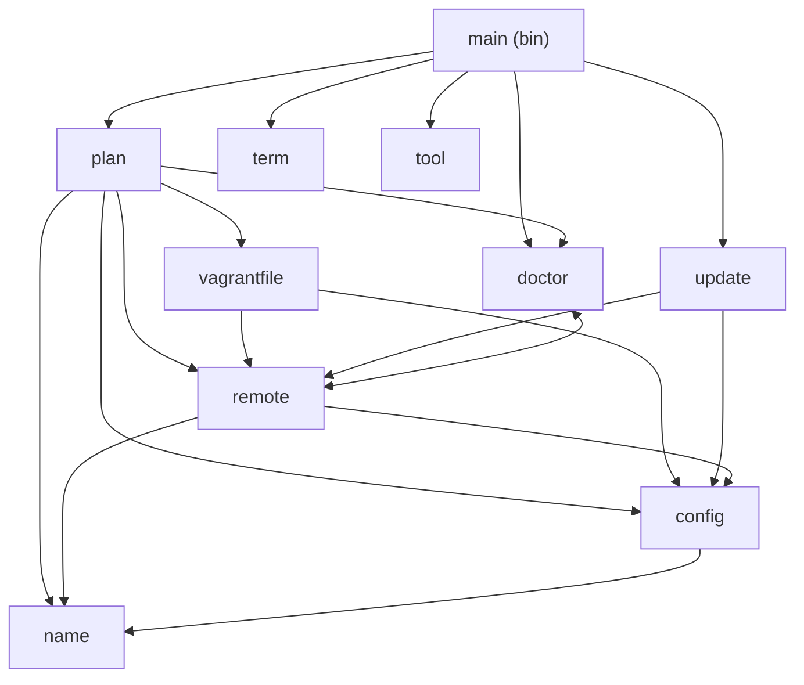
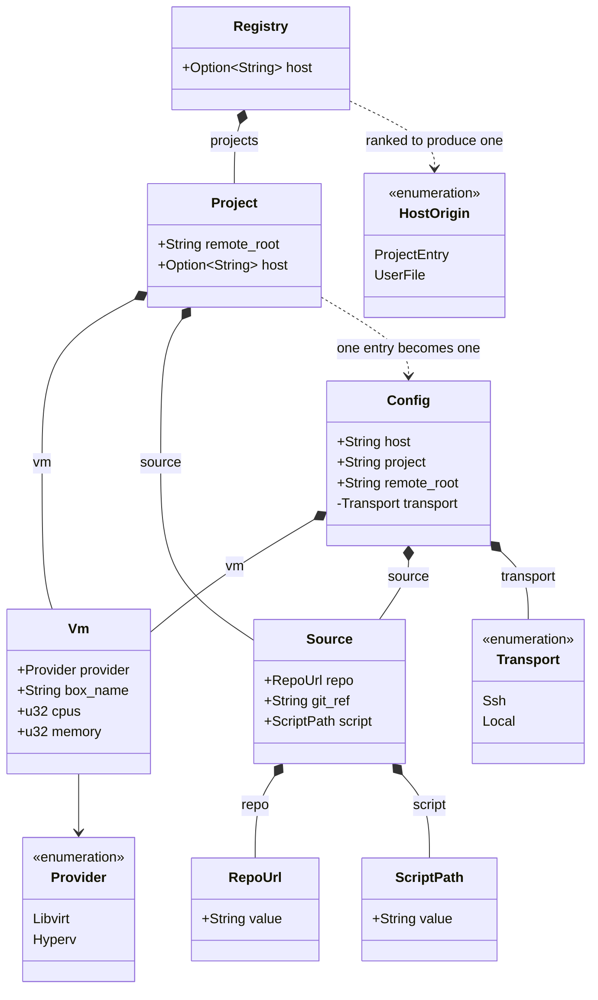
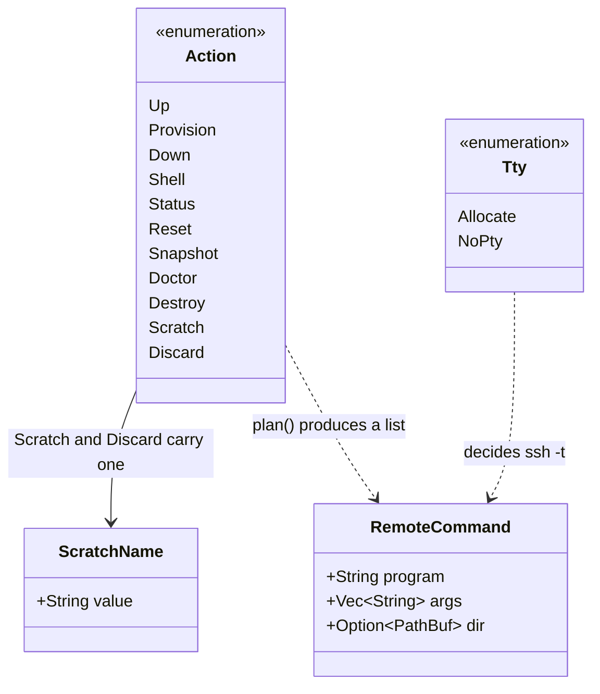
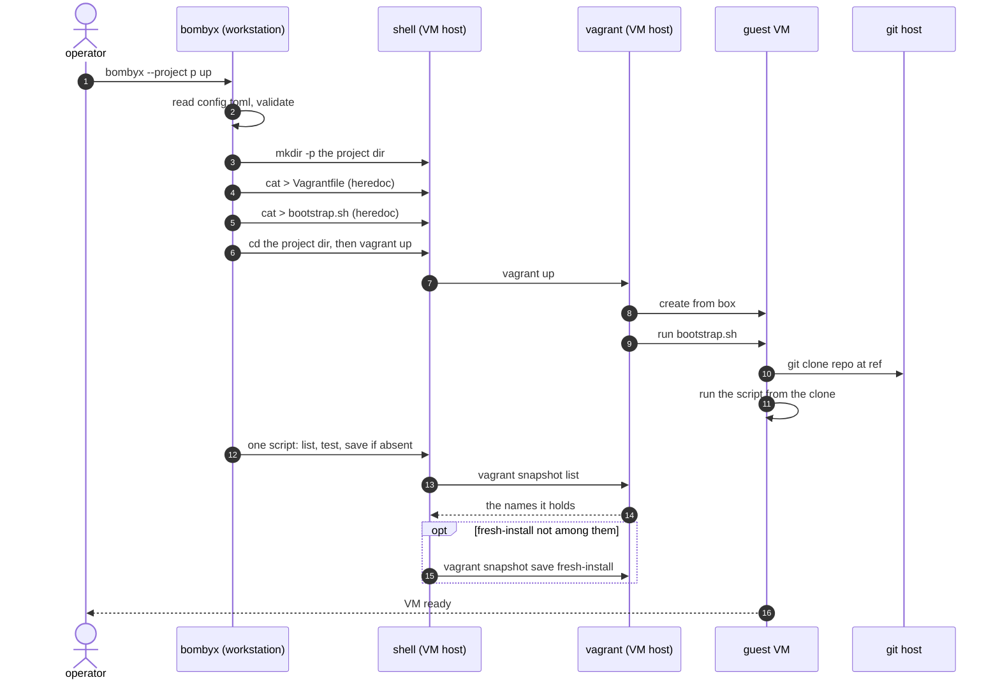
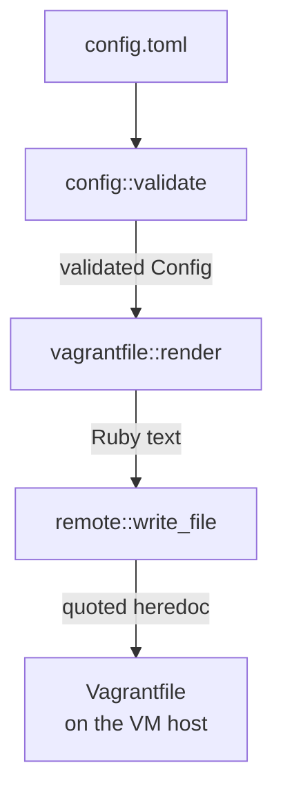

# Architecture

bombyx runs `vagrant` on a VM host, usually a second machine
reached over SSH, so an agent works inside a VM and the
workstation stays clean. It composes `ssh` and `vagrant` and
reimplements neither.

## The three machines



The workstation never runs project code. The VM host runs
`vagrant` and holds a directory per project. The guest is the
only machine that clones the repository.

**Three roles, not necessarily three machines.** The
workstation can be its own VM host, and bombyx notices when it
is. As `config.toml` is read, bombyx compares `host` against
this machine's own name; when the two match it runs the script
through `sh -c` here instead of handing it to `ssh`.

Two rules keep that comparison honest, and both exist because
the wrong answer boots a guest on the workstation while the
operator believes it is elsewhere.

The first is that the two names must be equal, ignoring case
and nothing else. A domain is written to say *which* machine,
and a bare label is shared easily -- `ubuntu`, `vagrant`,
`build01` -- so `build01.dmz.example` and
`build01.corp.example` are two machines, and so are
`frosti.lan` and a machine calling itself plain `frosti`.
The two rules err in opposite directions, and only one of them
is affordable. Matching on less than the whole name errs
towards the local route, which is the dangerous answer: a guest
boots on the workstation and teardown deletes there. Exact
matching errs towards `ssh`, which costs the operator a
handshake they were not expecting -- they see it, and write
what `hostname` prints.

bombyx does not read `~/.ssh/config`, so an alias named exactly
what this machine is named is believed even when it points
elsewhere. `you@name` is the spelling that forces `ssh`, and
`config::transport`'s test table pins it.

The second is that Windows never takes the local route at all,
because it cannot run libvirt. The route would still get far
enough to write files into the MSYS home and later delete them,
which is worse than failing.

One more difference is not in the script and is worth
knowing. `sh -c` is a child of bombyx and inherits its whole
environment, where `sshd` builds the far side's fresh. Three
vagrant variables -- `VAGRANT_CWD`, `VAGRANT_VAGRANTFILE` and
`VAGRANT_DOTFILE_PATH` -- override the directory every script
bounds itself with, so `remote`'s local branch unsets them
before the script runs. Without that, an operator with
`VAGRANT_CWD` exported would have `destroy` check one project
and destroy another. The script
is identical either way, because every command bombyx builds is
a POSIX shell script string and `sh -c` starts the same shell
`ssh` would have started on the host. `config::transport` holds
the comparison and `remote::transport` holds the one wrapper
that acts on it.

Two consequences are worth stating plainly. The first is that
one `config.toml` now behaves differently depending on which
machine reads it, so bombyx prints a line naming the route
whenever the local one is in force, and `bombyx doctor` shows
its `ssh` and `login shell` rows as skips rather than passes --
neither question has anything left to answer on this route.

The second is what running the guest on your own workstation
costs, which is the part of the isolation that depends on the
host being elsewhere: a guest that escapes the hypervisor is
already on your workstation, and network isolation from your
own machine means nothing. The VM boundary still holds --
separate kernel, no host filesystem, none of your credentials
(see `docs/trust-boundary.md` for the one the guest does need).
`docs/tutorial.md` has the setup, and `docs/vm-host-wsl2.md`
covers running the host as a WSL2 distribution on a Windows
workstation.

No box in the diagram is the project's repository, and that is
the point: neither the workstation nor the VM host reads any
file from it. The VM host reads none because the push that sent
it `vagrant/` is gone. The workstation reads none because every
setting comes out of `config.toml`, which lives in the
operator's config directory, and `--project` names the project
rather than the working directory implying it. The workstation
therefore needs no checkout at all.
`docs/trust-boundary.md` has the reasoning.

## Library modules

Everything with a decision in it lives in the library, because
`src/bin/` is outside the coverage gate.



`doctor` and `remote` reference each other: `remote` builds the
probe commands, `doctor` decides what their output means.

| Module | Owns |
|--------|------|
| `plan` | which commands run, and in what order |
| `config` | the registry, and the `Config` every command reads |
| `config::read` | reading a config file: symlinks, size, TOML errors |
| `config::error` | `ConfigError` for a file, `FieldError` for a value |
| `config::guards` | the rules more than one field shares |
| `config::host` | where the VM host name comes from, and its shape |
| `config::registry` | the operator's `config.toml` and its project tables |
| `config::root` | what `remote_root` may be, and why it is strict |
| `config::source` | `[source]`, and the two checked types it holds |
| `config::transport` | whether `host` names this very machine |
| `config::vm` | `[vm]`, and the checks a type cannot express |
| `vagrantfile` | rendering the Vagrantfile and the bootstrap |
| `remote` | building the argv for either route, quoting |
| `remote::write` | the heredoc that writes a generated file |
| `doctor` | preconditions, and what a result means |
| `update` | `self-update`: download, verify, swap |
| `name` | scratch-VM names, and path segments |
| `term` | line endings, per stream |
| `tool` | resolving a program, never via the cwd |

`main` parses arguments, spawns processes and prints. Nothing
else.

## Domain entities

What a project declares:



`Config` is what bombyx runs with. `Registry` and `Project`
parse the file it comes out of: a file-wide `host`, and one
`[projects.<name>]` table per project carrying `remote_root`,
`[vm]`, `[source]` and an optional `host` of its own.

`Config::load_project` turns one entry into a `Config`. It reads
the file once and takes everything from it: the entry supplies
every setting but the host, and `config::host::rank` picks
between that entry's own `host` and the file-wide one, the entry
winning. One read rather than two, because a file edited mid-run
could otherwise supply a project host and a file-wide host that
never coexisted.

An operator who keeps one project on a different machine writes
`host` in that project's table, and bombyx then prints a line on
stderr naming the table. That notice exists because both keys
live in one file and `destroy` runs `rm -rf` on whichever wins.

`transport` is the one field of `Config` no key supplies.
`config::transport` derives it from the winning `host` and this
machine's own name. It is derived from the *winner* rather than
from either key, so the machine bombyx runs the commands on and
the machine `destroy` deletes a directory on are always the
same one.

It is also the one field of `Config` that is private, read
through `Config::transport()`. Every other field is public.
Privacy here stops a caller *choosing* the route, and that is
all it stops: `host` is public, so a caller holding a loaded
`Config` can assign a new one, nothing re-checks, and the route
then names one machine while the commands run on another.
`host` is a `HostName`, so the value assigned has passed the
host rule; what nothing re-derives is the route beside it.

Two Rust names differ from their TOML keys, because `box` and
`ref` are Rust keywords: `box_name` is `box`, and `git_ref` is
`ref`.

What bombyx does with it:



`plan()` turns one `Action` and a `Config` into an ordered
`Vec<RemoteCommand>`, and nothing else in the library spawns a
process. That is what makes `--dry-run` honest and the ordering
testable.

`Scratch` and `Discard` carry a `ScratchName`, which is a
validated newtype rather than a `String`: it must be one path
segment, so a name that would escape the scratch directory
cannot reach `plan()` at all.

## `bombyx up`, end to end



Three things matter about the order. The directory is created
first, because the heredocs write into it. `vagrant up` runs
after them, because it reads the Vagrantfile they just wrote.
And the snapshot is saved after the boot, so it records a
machine that has finished provisioning.

The four arrows from `one script` to the save are a single
command. bombyx sends one shell script holding the listing, the
test and the save, so the host's shell is what reads the listing
and what decides; bombyx receives neither the names nor the
decision. `VM ready` below them is not something bombyx emits at
all -- it is the operator seeing a working machine.
`vagrant snapshot list` exits 0 whether or not the machine has
snapshots, so the script tests its output rather than its
status.

Pretty-printed, and with the identity prefix left off each
`vagrant` call, that script is:

```sh
cd <project dir> && {
  names=$(vagrant snapshot list) &&
  if ! printf '%s\n' "$names" | grep -qx 'fresh-install'; then
    vagrant snapshot save fresh-install
  fi || printf 'bombyx: could not save ...\n' >&2
}
```

Three parts of that carry weight. Capturing the listing rather
than piping it into `grep` is what stops a listing vagrant could
not produce being read as an empty one, because a pipeline
reports only its last command's status. The braces keep the `cd`
outside the `||`, so a project directory that has gone away
still fails the step. And the `||` itself makes the snapshot
advisory: it is the last step of `up`, and without it a VM that
booted correctly would report failure because a snapshot could
not be taken.

The `if` is what keeps `fresh-install` meaning what it says.
Only the first `up` finds the name missing; every later one
follows arbitrary use of the machine and must not overwrite the
point `reset` returns to. `bombyx snapshot` is the way to
overwrite it deliberately, and it passes `-f` rather than
sharing this guard.

Every step is one command, and which command depends on the
route. Over SSH each step is an `ssh`. Running on the VM host
itself each step is an `sh -c` carrying the same script. Either
way bombyx spawns exactly one process per step and interprets
none of the script itself. The one `cli` self-call in the
diagram is reading the config, which happens before there is a
plan to run.

`provision` is the same sequence ending in `vagrant provision`,
which exists because vagrant runs provisioners only when it
first creates a machine.

## What config values are checked

**The registry is usually the operator's own file, and bombyx
cannot assume it.** Two arguments point the loader elsewhere.
`--config <path>` reads any file at all, including one committed
in a clone. `BOMBYX_CONFIG_HOME` only has to be *anchored*, so
an absolute path into a clone is accepted, and a per-directory
environment tool (`direnv`, `mise`, a CI job) sets it from
inside one. Either way the values are then repo-supplied.

So the allowlist is a boundary rather than a typo check. Each
of those rules is what stops a repo-supplied value reaching
`ssh` or `rm -rf`, so none of them is there to catch a typo.
Six values reach the generated files and so the guest --
`box`, `repo`, `ref`, `script`, `cpus` and `memory` -- and
`remote_root` reaches
`rm -rf` on the VM host. A registry out of a clone with
`remote_root = "/etc"` gets `rm -rf /etc/<project>` there, which
is `RemoteRoot`'s depth floor doing the work it exists for.

What the guards do *not* stop is the redirect itself: bombyx
opens no file in a project's directory of its own accord, and it
opens the one `--config` names without asking where it came
from. `docs/usage.md` under **What is checked, and what is not**
is the operator-facing half of this.

Four values are enforced by their type: `remote_root` is a
`RemoteRoot`, `repo` a `RepoUrl`, `script` a `ScriptPath` and
`host` a `HostName`. Each is a newtype whose constructor holds
the rules, so an invalid one cannot be built -- by a config file
or by a library caller. For the first three, serde runs the
constructor while deserializing, so a bad value is refused
before a `Config` exists and the error identifies the line.

`HostName` is the exception, and it has no
`#[serde(try_from = "String")]`. The registry carries a `host`
key per project and one more below them all, so the field name
`host` does not tell an operator which line to edit. Instead
`config::host::checked` takes a `HostOrigin` and names the
source, and serde cannot supply one because it does not know
which key it is reading. Trading that answer for a line number
would be the worse deal, so the host rule runs where the origin
is known.

The remaining four -- `box`, `ref`, `cpus` and `memory` -- are
only *checked* after parsing, in `vm::validate` and
`source::validate`, and so is `project` in `Config::validate`.
`Vm`, `Source` and `Config` all have public fields, so a
hand-built one never reaches those functions. **That is a gap,
not a decision we would make again**, and issue #43 is the work
that closes it.

`Project`, the registry's per-project entry, carries the same
values less `project`, which is its table key.

**Every `host` in the registry is checked as the file is read**,
by `config::registry::parse` -- the file-wide one and every
project's, not only the one a command turns out to want. This is
the file where the operator writes host names, so a value bombyx
would refuse is a mistake to report while they are looking at
it; checking only the winner leaves a typo in an unused line
until the day that line wins.

Holding a `Registry` is therefore the proof that every host in it
passed. `config::host::rank` then builds the winner into a
`HostName`, and the check it runs there is the second of two:
it cannot fail on a `Registry` that came through `parse`, and it
runs so that `rank` does not depend on a rule applied in another
module. `Registry::host` and `Registry::project_host` hand raw
values out without re-running it, and neither
`Project::validate` nor `Config::validate` checks `host`.
`host` is the one field absent from both, which looks like an
omission and is not.

`Config::load_project` then runs `Config::validate` over the
value it assembles, so an entry's fields are checked twice. That
is deliberate rather than an oversight: `validate` is what every
path building a `Config` calls, so a field added to `Config`
without a matching check on the entry is still refused.

Four values in an entry are checked before any lookup: the
project name, because it is the table key and a `ProjectName`;
`repo` and `script`, because their types refuse a bad value; and
`host`, by the pass described above. The rest are checked when
`Registry::project` hands the entry out, so a rule broken in one
project's table is reported when that project is asked for. A
table that does not *parse* is not like that: the whole file
fails, whichever project it belongs to.

A type promises that its rules *ran*. A checking function
promises only that they ran on the paths that call it.
`Config`, `Vm`, `Source` and `Project` all have public fields,
so any code can build one by hand and reach the guest without
`validate` ever being called -- and a field whose rules are
dull is as exposed as one whose rules are sharp. `validate` is
also private, so a library caller cannot even choose to call
it.

`Project` is the sharpest case of that, because the guarantee
about its `host` belongs to a different type. It is holding a
`Registry` that proves every host in the file passed, since
`config::registry::parse` is the only way to build one. Holding
a `&Project` proves the same thing only when
`Registry::project` handed it over. `Project` is public,
re-exported from the crate root, derives `Deserialize` and has
a public `host`, so a library consumer can deserialize one from
any text at all and read a `host` no rule has touched. Nothing
inside bombyx does that -- the loader takes the host from
`config::host::rank`, over a `Registry` -- so this is a trap for
a future caller rather than a live hole.

### The heading spelling has one owner

Three error messages quote a project name back at the operator
inside a TOML table heading: `ConfigError::ProjectNotFound`,
`ConfigError::RegistryNotFound`, and `HostOrigin::describe` when
a project entry supplied the host. All three ask
`config::registry::heading` for it, and that function is the only
place the spelling exists.

The spelling is not obvious, which is why it needs an owner. A
project name may contain a `.` -- `name::check_segment` allows
one after the first character -- and TOML reads a bare dot in a
heading as nesting. So `[projects.a.b]` declares `b` inside
`projects.a`, `deny_unknown_fields` refuses the whole file, and
an operator who follows that advice breaks every project rather
than fixing one. Quoting is valid TOML for every name the check
accepts, so `[projects."a.b"]` is right for all of them and the
message never has to guess which names need it.

It took three review rounds to find all three copies. The first
round found a missing name check, the second found two messages
spelling the heading unquoted and fixed those two, and the third
found the last one -- in the message that this work had just made
reachable. That is `/review`'s "the rule has no single home"
pattern, and the consolidation was deliberately left out of the
round that found it.

`every_message_spells_a_project_heading_the_same_way` in
`config/registry.rs` is what holds it: it asserts one spelling
across all three messages, so a fourth message spelling the
heading itself would pass whatever test it brought and fail that
one. Unquoting `heading` fails nine tests.

The test fixtures write their headings out rather than calling
`heading`. That is deliberate: a fixture and the message checked
against it must not come from the same code, or a wrong spelling
agrees with itself and every test still passes.

### Two traps a reader cannot see from the code

Both of these were code comments once, and `CLAUDE.md` under
**Code comments** now says a trap aimed at a future editor lives
here instead. Neither is visible at the place it matters.

The first is the one above: the `Project` guarantee is a
property of `Registry`, not of `Project`.

The second is that `--project` is required by hand rather than
by clap. clap cannot mark one global argument required for some
subcommands and not others, and `self-update` is the subcommand
that must run on a machine with no registry at all. So `main`
states the requirement itself, after the `self-update` branch has
already returned. A third config-less subcommand added to `Cmd`
gets that for free; one added to `VmCmd` does not, and would
fail at the requirement rather than at compile time.

### The unchecked-field gap, and what limits it

Five fields of `Config` and its two tables are still a plain
`String` or `u32`: `project`, `box`, `ref`, `cpus` and
`memory`. Every field of `Config` is public except the
transport, so a caller holding a loaded one can assign any of
the five and nothing re-checks. Issue #43 is the work that
gives each of them a type.

Three things keep that survivable in the meantime. `render`
escapes for Ruby whatever it is handed. `bootstrap.sh` passes
`--` before the ref. And inside this crate the only place that
builds a `Config` is `Project::to_config`, whose caller runs
`validate` immediately -- so for bombyx's own commands the check
does run.

A library consumer is not covered by that, and the public fields
are why. `load_project` hands the caller an owned `Config`, and
assigning `cfg.project = "..."` on it compiles and reaches
`plan` with nothing having checked the new value. That is the
whole argument for the remaining types: a type carries its proof
to every use site, and a checking function carries it only to
the paths that call it.

`remote_root` and `host` were the two worth doing first, and
they are done. `remote_root` reaches `rm -rf` and `host` reaches
`ssh`, and both now hold their rules in a constructor:
`RemoteRoot` in `config::root` and `HostName` in `config::host`.

| Field | Refused | Because |
|-------|---------|---------|
| `box` `repo` `ref` `script` | empty or blank | no meaning when blank |
| `box` `repo` `ref` `script` | leading or trailing whitespace | almost always a copy-paste artifact, and it fails far from here — a trailing space on `repo` comes back from the guest as `repository '...' does not exist` |
| `box` `repo` `ref` `script` | control characters | end the line in a Ruby file |
| `box` `repo` `ref` `script` | `"` or `\` | end or escape the Ruby literal |
| `box` `repo` `ref` `script` | `#{` | Ruby interpolation is evaluated |
| `repo` `ref` `script` | leading `-` | `git` would treat it as an option |
| `host` `project` `remote_root` | leading `-` | the program each one reaches would treat it as an option. `host` and `remote_root` carry the rule in their constructors, `project` in `Config::validate`. For `host` it is live — it is `ssh`'s first positional argument. Running on the VM host itself no argv position holds it, but the rule still applies, because the same `config.toml` carried to another machine takes the `ssh` route. For the other two it is a precaution, since both are shell-quoted before the far shell receives them |
| `repo` | anything but an `https` `http` `ssh` `git` URL, or `user@host:path` | `ext::` and the other remote helpers run a command instead of cloning |
| `script` | leading `/`, a `..` segment | it is made executable and run as root inside the clone |
| `cpus` `memory` | zero | vagrant would refuse it on the VM host, after bombyx had already created a directory there |

`project` and `remote_root` have rules of their own in the same
places: `Config::validate` for `project`, and `config::root` for
every rule `remote_root` must pass. `remote_root`'s run twice,
once as `Registry::project` hands the entry out and again over
the assembled `Config`.
`project` must be one path segment, because it becomes one
directory name on the VM host.

`remote_root` has the strictest rules of the three, because
bombyx runs `rm -rf` on a path derived from it. All of them live
in `config::root`, blank and leading-dash included, so a second
caller cannot pick up half the set.

It must start with `/` or `~/`. A bare
`~name` is refused even though it looks anchored: to a shell
that means another user's home directory, and
`quote_remote_path` leaves the tilde outside the quotes only for
`~` and `~/`. So `~vms` would be emitted fully quoted and the
remote shell would read it as an ordinary relative name,
resolved against the SSH login directory — the outcome the
anchoring rule exists to prevent.

It must also contain **at least one directory below that root**,
so `~/vms` and `/srv/vms` are accepted while `~`, `/` and `~/`
are refused. Joining the project name onto it then makes the
directory bombyx creates and deletes at least two deep, which
keeps a configuration mistake from targeting a top-level or
home-adjacent directory.

A `.` or `..` segment is refused as well: either one moves where
the path resolves without changing how deep it counts, and `/.`
with `project = "etc"` would otherwise pass as two segments
while resolving to `/etc`.

## Why three stages and not one



Each stage is safe on its own rather than trusting the one
before it. `render` escapes every `"`, `\` and `#` even though
`validate` already refused them. `write_file` lengthens its
heredoc delimiter until no payload line equals it, rather than
assuming the payload came from `render`.

The repetition is not redundant, and the newtypes narrowed it
rather than removing it. A library caller can no longer build a
bad `repo` or `script`, because those fields hold `RepoUrl` and
`ScriptPath` and their inner values are private. `box` and
`git_ref` are still plain `String` fields on a public struct, so
`render` can still be handed a quote, and `write_file` can still
be handed a payload no renderer produced. A guard that lives in
another module is the one a new field gets added without.

## Quality gates

`cargo xtask validate` runs every gate in one pass. The
dependency cooldown goes first so nothing compiles a too-new
crate; after that they run cheapest first, ending with the
network audit. `CLAUDE.md` under **Definition of Done** lists
them in run order and is the one place that does, so this
paragraph does not repeat the list -- two copies of it drifted
apart once already. It also says why `audit` degrades to a
warning inside `validate` and errors when run alone.
