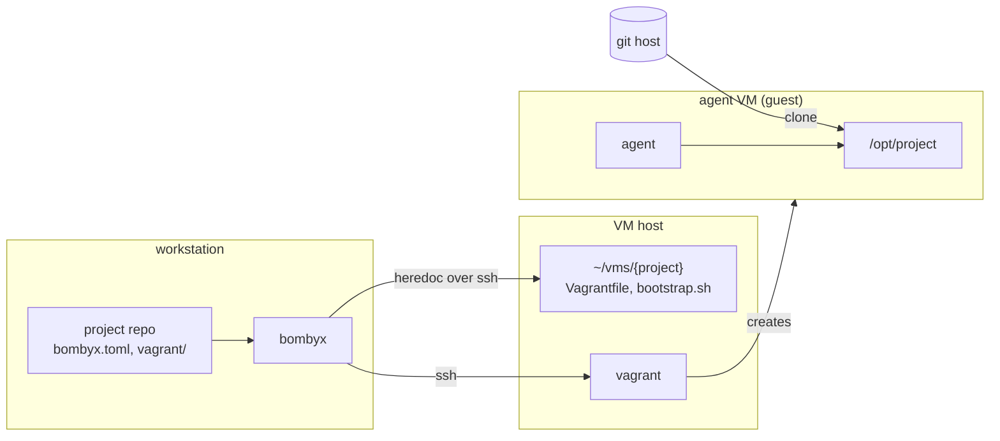
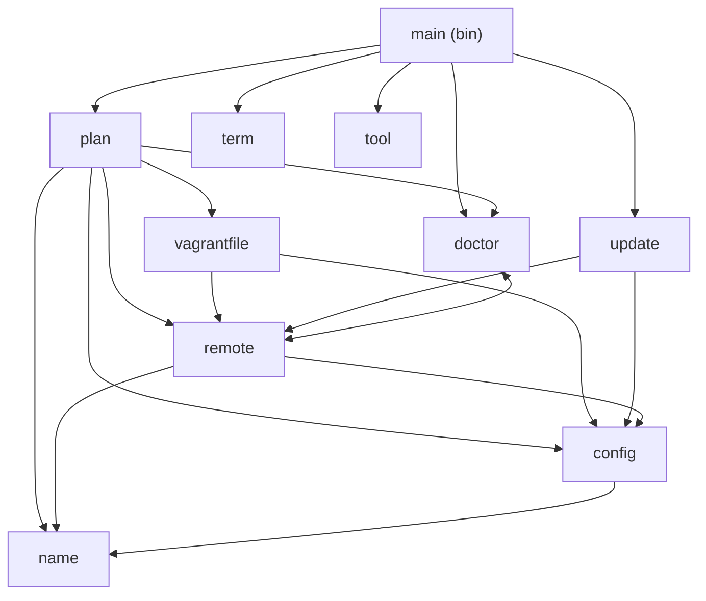
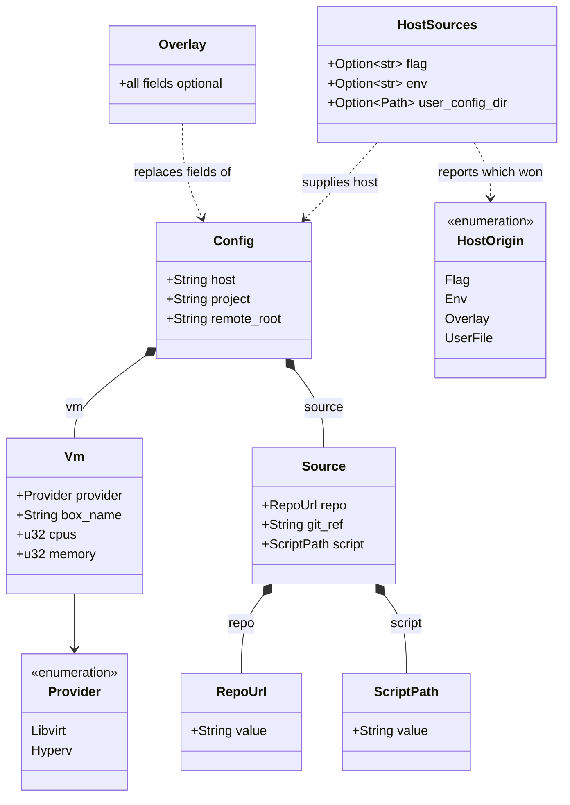
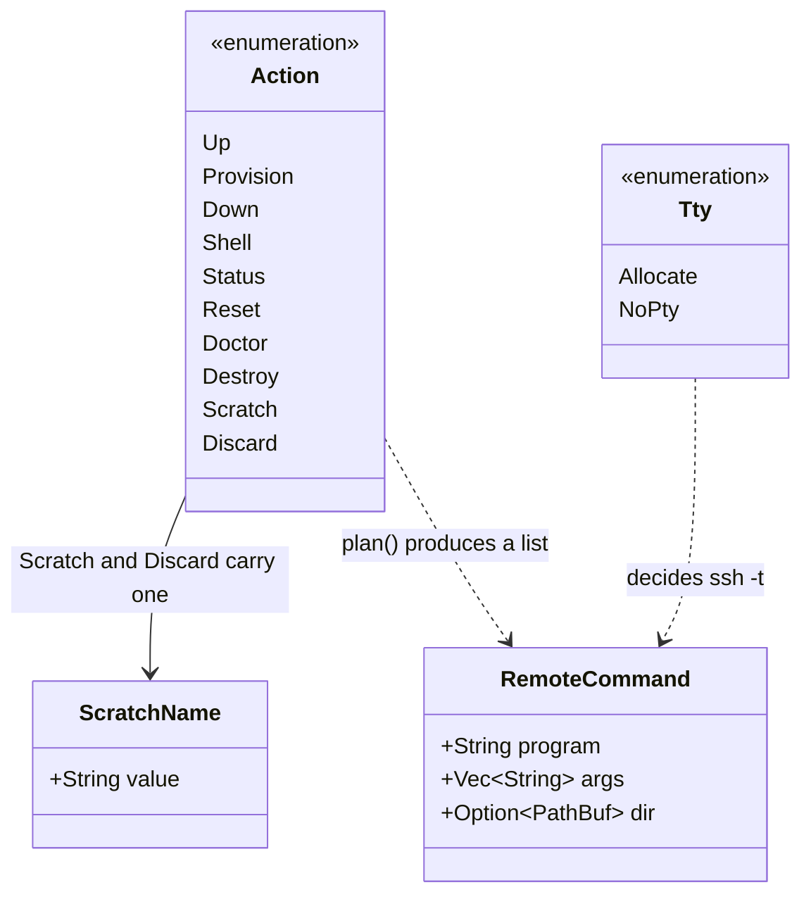
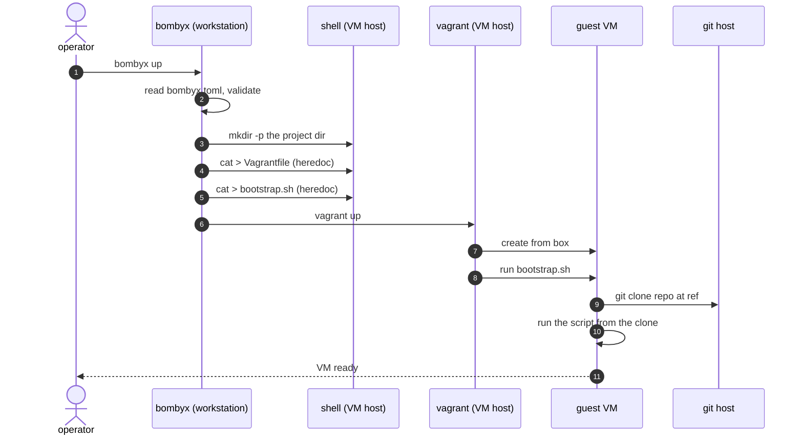
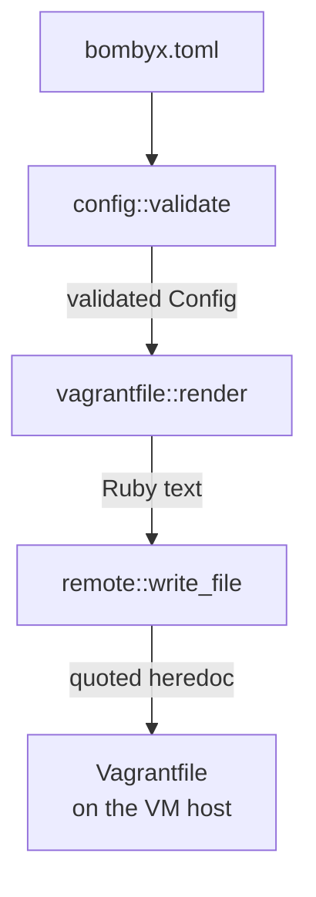

# Architecture

bombyx runs `vagrant` on a remote VM host over SSH, so an agent
works inside a VM and the workstation stays clean. It composes
`ssh` and `vagrant` and reimplements neither.

## The three machines

The workstation never runs project code. The VM host runs
`vagrant` and holds a directory per project. The guest is the
only machine that clones the repository.

**Three roles, not necessarily three machines.** `host` is an
SSH alias, so it can name loopback and the workstation can be
its own VM host. There is no local mode and none is needed.
What that costs is the part of the isolation that depends on
the host being elsewhere: a guest that escapes the hypervisor
is already on your workstation, and network isolation from your
own machine means nothing. The VM boundary still holds --
separate kernel, no host filesystem, no credentials.
`docs/tutorial.md` has the setup, and `docs/vm-host-wsl2.md`
covers running the host as a WSL2 distribution on a Windows
workstation.

The diagram shows today, not the target. The `project repo`
box and the arrow leaving it are what the design is working to
remove: the goal is that neither the workstation nor the VM
host reads **any** file from the project's repo. The VM host
already reads none -- the push that sent it `vagrant/` is gone.
The workstation still reads `bombyx.toml` out of the working
directory, so it still holds a checkout, and
`project-config-off-repo` is the work that closes that.
`docs/trust-boundary.md` has the reasoning and the remaining
steps.

## Library modules

Everything with a decision in it lives in the library, because
`src/bin/` is outside the coverage gate.

`doctor` and `remote` reference each other: `remote` builds the
probe commands, `doctor` decides what their output means.

| Module | Owns |
|--------|------|
| `plan` | which commands run, and in what order |
| `config` | `bombyx.toml`, and the `Config` every command reads |
| `config::read` | reading a config file: symlinks, size, overlay path |
| `config::error` | `ConfigError` for a file, `FieldError` for a value |
| `config::guards` | the rules more than one field shares |
| `config::host` | where the VM host name comes from, and its shape |
| `config::root` | what `remote_root` may be, and why it is strict |
| `config::source` | `[source]`, and the two checked types it holds |
| `config::vm` | `[vm]`, and the checks a type cannot express |
| `vagrantfile` | rendering the Vagrantfile and the bootstrap |
| `remote` | building `ssh` argv, quoting |
| `remote::write` | the heredoc that writes a generated file |
| `doctor` | preconditions, and what a result means |
| `update` | `self-update`: download, verify, swap |
| `name` | scratch-VM names, and path segments |
| `term` | line endings, per stream |
| `tool` | resolving a program, never via the cwd |

`main` parses arguments, spawns processes and prints. Nothing
else.

## Domain entities

What a project declares:

`Config` is what bombyx runs with. `host` is the one field never
read from `bombyx.toml`, because a VM host belongs to a person
rather than a project.

Two Rust names differ from their TOML keys, because `box` and
`ref` are Rust keywords: `box_name` is `box`, and `git_ref` is
`ref`.

What bombyx does with it:

`plan()` turns one `Action` and a `Config` into an ordered
`Vec<RemoteCommand>`, and nothing else in the library spawns a
process. That is what makes `--dry-run` honest and the ordering
testable.

`Scratch` and `Discard` carry a `ScratchName`, which is a
validated newtype rather than a `String`: it must be one path
segment, so a name that would escape the scratch directory
cannot reach `plan()` at all.

## `bombyx up`, end to end

Two things matter about the order. The directory is created
first, because the heredocs write into it. And `vagrant` runs
last, because it reads the Vagrantfile that the heredocs just
wrote.

Every step is an `ssh`. bombyx runs no program on the
workstation for a VM action, which is why the `cli` lifeline
has no self-call.

`provision` is the same sequence ending in `vagrant provision`,
which exists because vagrant runs provisioners only when it
first creates a machine.

## What config values are checked

`bombyx.toml` travels inside a repo, so its values are treated
as hostile input. Six of them reach the generated files:
`box`, `repo`, `ref`, `script`, `cpus` and `memory`.

Two of those six are enforced by their type. `repo` is a
`RepoUrl` and `script` is a `ScriptPath`, each a newtype whose
constructor holds the rules, so an invalid one cannot be built
-- by a config file or by a library caller. serde runs the
constructor while deserializing, so a bad value is refused
before a `Config` exists, and the error identifies the line.

The other four -- `box`, `ref`, `cpus` and `memory` -- are only
*checked* after parsing. So are `host`, `project` and
`remote_root`, which never reach the generated files but do
reach `ssh`. Seven values in all, spread across
`Config::validate`, `vm::validate` and `source::validate`.
**That is a gap, not a decision we would make again.**

A type promises that its rules *ran*. A checking function
promises only that they ran on the paths that call it.
`Config`, `Vm` and `Source` all have public fields, so any
code can build one by hand and reach the guest without
`validate` ever being called -- and a field whose rules are
dull is as exposed as one whose rules are sharp. `validate` is
also private, so a library caller cannot even choose to call
it.

Three things keep that survivable meanwhile. `render` escapes
for Ruby whatever it is handed. `bootstrap.sh` passes `--`
before the ref. And the loading path is the only way a
`Config` is built today, so in practice `validate` does run.

`remote_root` should stop being a `String` first: it reaches
`rm -rf`, and `config::root` already holds all of its rules in
a single function, so the constructor would wrap something
that exists. Captured as `newtype-remaining-config-fields` in
`docs/todo.md`.

| Field | Refused | Because |
|-------|---------|---------|
| `box` `repo` `ref` `script` | empty or blank | no meaning when blank |
| `box` `repo` `ref` `script` | leading or trailing whitespace | almost always a copy-paste artifact, and it fails far from here — a trailing space on `repo` comes back from the guest as `repository '...' does not exist` |
| `box` `repo` `ref` `script` | control characters | end the line in a Ruby file |
| `box` `repo` `ref` `script` | `"` or `\` | end or escape the Ruby literal |
| `box` `repo` `ref` `script` | `#{` | Ruby interpolation is evaluated |
| `repo` `ref` `script` | leading `-` | `git` would treat it as an option |
| `host` `project` `remote_root` | leading `-` | the program each one reaches would treat it as an option. For `host` that is live — it is `ssh`'s first positional argument. For the other two it is a precaution, since both are shell-quoted before `ssh` carries them |
| `repo` | anything but an `https` `http` `ssh` `git` URL, or `user@host:path` | `ext::` and the other remote helpers run a command instead of cloning |
| `script` | leading `/`, a `..` segment | it is made executable and run as root inside the clone |
| `cpus` `memory` | zero | vagrant would refuse it on the VM host, after bombyx had already created a directory there |

The older fields have their own rules, in the same place.
`project` must be one path segment, because it becomes one
directory name on the VM host.

`remote_root` has the strictest rules of the three, because
bombyx runs `rm -rf` on a path derived from it. All of them live
in `config::root`, blank and leading-dash included, so a second
caller cannot pick up half the set.

It must start with `/` or `~/`, or be exactly `~`. A bare
`~name` is refused even though it looks anchored: to a shell
that means another user's home directory, and
`quote_remote_path` leaves the tilde outside the quotes only for
`~` and `~/`. So `~vms` would be emitted fully quoted and the
remote shell would read it as an ordinary relative name,
resolved against the SSH login directory — the outcome the
anchoring rule exists to prevent.

It must also contain **at least one directory below that root**,
so `~/vms` and `/srv/vms` are accepted while `~`, `/` and `~/`
are refused. Joining the project name onto it then makes the
directory bombyx creates and deletes at least two deep, which
keeps a configuration mistake from targeting a top-level or
home-adjacent directory.

A `.` or `..` segment is refused as well: either one moves where
the path resolves without changing how deep it counts, and `/.`
with `project = "etc"` would otherwise pass as two segments
while resolving to `/etc`.

## Why three stages and not one

Each stage is safe on its own rather than trusting the one
before it. `render` escapes every `"`, `\` and `#` even though
`validate` already refused them. `write_file` lengthens its
heredoc delimiter until no payload line equals it, rather than
assuming the payload came from `render`.

The repetition is not redundant, and the newtypes narrowed it
rather than removing it. A library caller can no longer build a
bad `repo` or `script`, because those fields hold `RepoUrl` and
`ScriptPath` and their inner values are private. `box` and
`git_ref` are still plain `String` fields on a public struct, so
`render` can still be handed a quote, and `write_file` can still
be handed a payload no renderer produced. A guard that lives in
another module is the one a new field gets added without.

## Quality gates

`cargo xtask validate` runs nine. The dependency cooldown goes
first so nothing compiles a too-new crate; after that they run
cheapest first: formatting, duplication, licences, clippy, doc
links, tests, coverage, security audit. `CLAUDE.md` has the detail,
including why `audit` degrades to a warning inside `validate`
and errors when run alone.
