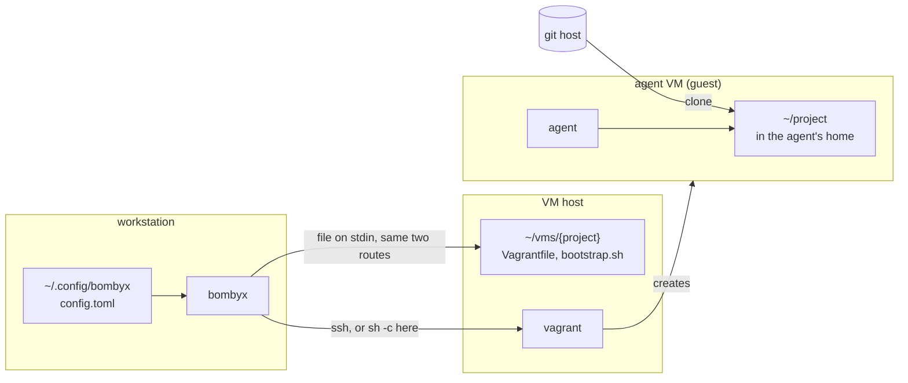
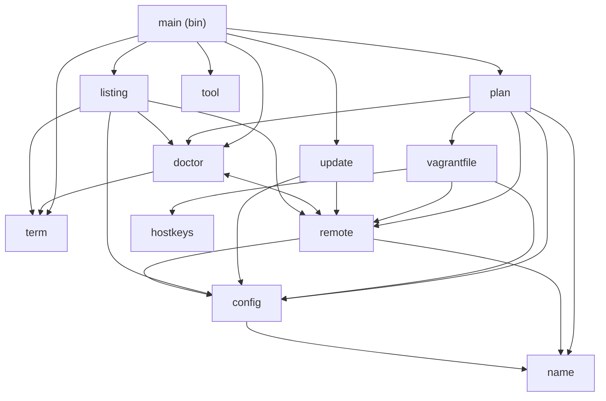
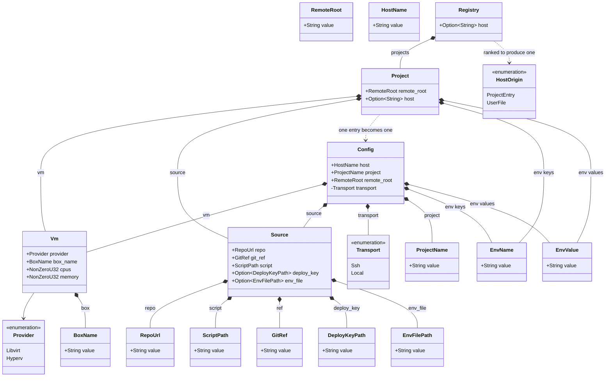
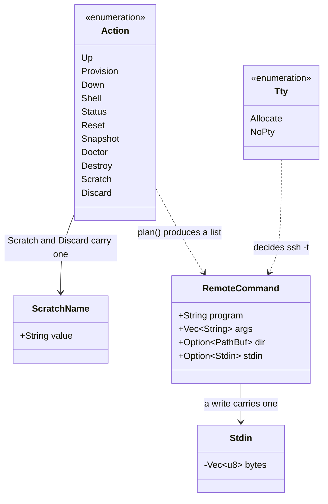
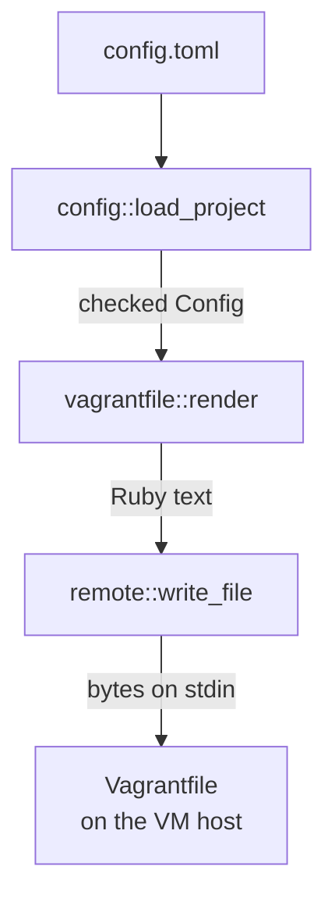

# Architecture

bombyx runs `vagrant` on a VM host, usually a second machine
reached over SSH, so an agent works inside a VM and the
workstation stays clean. It composes `ssh` and `vagrant` and
reimplements neither.

## The three machines



The workstation never runs project code. The VM host runs
`vagrant` and holds a directory per project. The guest is the
only machine that clones the repository.

**Three roles, not necessarily three machines.** The
workstation can be its own VM host, and bombyx notices when it
is. As `config.toml` is read, bombyx compares `host` against
this machine's own name; when the two match it runs the script
through `sh -c` here instead of handing it to `ssh`.

Two rules keep that comparison honest, and both exist because
the wrong answer boots a guest on the workstation while the
operator believes it is elsewhere.

The first is that the two names must be equal, ignoring case
and nothing else. A domain is written to say *which* machine,
and a bare label is shared easily -- `ubuntu`, `vagrant`,
`build01` -- so `build01.dmz.example` and
`build01.corp.example` are two machines, and so are
`frosti.lan` and a machine calling itself plain `frosti`.
The two rules err in opposite directions, and only one of them
is affordable. Matching on less than the whole name errs
towards the local route, which is the dangerous answer: a guest
boots on the workstation and teardown deletes there. Exact
matching errs towards `ssh`, which costs the operator a
handshake they were not expecting -- they see it, and write
what `hostname` prints.

bombyx does not read `~/.ssh/config`, so an alias named exactly
what this machine is named is believed even when it points
elsewhere. `you@name` is the spelling that forces `ssh`, and
`config::transport`'s test table pins it.

The second is that Windows never takes the local route at all,
because it cannot run libvirt. The route would still get far
enough to write files into the MSYS home and later delete them,
which is worse than failing.

One thing both routes share is worth knowing, because it looks
at first like a difference. Three vagrant variables --
`VAGRANT_CWD`, `VAGRANT_VAGRANTFILE` and `VAGRANT_DOTFILE_PATH`
-- override the directory every script bounds itself with, and
two more decide the provider. An operator with `VAGRANT_CWD`
exported would have `destroy` check one project and destroy
another. So `remote::transport` writes an `unset` of all five
in front of every script, on both routes.

The reason differs per route even though the precaution does
not. `sh -c` is a child of bombyx and inherits its whole
environment, so anything the operator exported here arrives.
Over `ssh` bombyx's own environment stays behind, but the VM
host builds one of its own. Three sources reach the command
sshd runs: `pam_env` applies `/etc/environment`, `zsh` sources
`~/.zshenv` on every invocation and so on `zsh -c` too, and a
`bash` export placed above the non-interactive return guard in
`~/.bashrc` survives. The command sshd runs is neither
interactive nor a login shell, which is why `~/.profile` is not
in that list. A variable set on the VM host is as dangerous as
one set here. The `zsh` and `bash` halves are read from those
shells' documented startup order rather than measured
*(unverified)*.

Past that `unset` the script is identical on both routes,
because every command bombyx builds is a POSIX shell script
string and `sh -c` starts the same shell `ssh` would have
started on the host. `config::transport` holds the comparison
and `remote::transport` holds the one wrapper that acts on it.

Two consequences are worth stating plainly. The first is that
one `config.toml` now behaves differently depending on which
machine reads it, so bombyx prints a line naming the route
whenever the local one is in force, and `bombyx doctor` shows
its `ssh` and `login shell` rows as skips rather than passes --
neither question has anything left to answer on this route.

The second is what running the guest on your own workstation
costs, which is the part of the isolation that depends on the
host being elsewhere: a guest that escapes the hypervisor is
already on your workstation, and network isolation from your
own machine means nothing. The VM boundary still holds --
separate kernel, no host filesystem, none of your credentials
(see `docs/trust-boundary.md` for the one the guest does need).
`docs/tutorial.md` has the setup, and `docs/vm-host-wsl2.md`
covers running the host as a WSL2 distribution on a Windows
workstation.

The diagram shows no box for the project's repository, and that
is the point: neither the workstation nor the VM host reads any
file from it. The VM host reads none because the only two files
bombyx puts there are ones it generates itself. The workstation
reads none because every
setting comes out of `config.toml`, which lives in the
operator's config directory, and `--project` names the project
rather than the working directory implying it. The workstation
therefore needs no checkout at all. `docs/trust-boundary.md`
has the reasoning.

## Library modules

Everything with a decision in it lives in the library, because
`src/bin/` is outside the coverage gate.



`doctor` and `remote` reference each other: `remote` builds the
probe commands, `doctor` decides what their output means.

`listing` depends on `doctor` for one type. `ProbeResult` is
what running a command produced -- its exit status, its stdout
and its stderr -- and a listing command produces exactly that,
so `listing` holds the same type rather than declaring a second
one with the same three fields.

| Module | Owns |
|--------|------|
| `plan` | which commands run, and in what order |
| `config` | the registry, and the `Config` every command reads |
| `config::read` | reading a config file: symlinks, size, TOML errors |
| `config::error` | `ConfigError` for a file, `FieldError` for a value |
| `config::guards` | the rules more than one field shares |
| `config::host` | where the VM host name comes from, and its shape |
| `config::registry` | the operator's `config.toml` and its project tables |
| `config::root` | what `remote_root` may be, and why it is strict |
| `config::deploy_key` | what `deploy_key` may be, and why |
| `config::env_file` | what `env_file` may be, and the file it names |
| `config::source` | `[source]`, and the three checked types it holds |
| `config::transport` | whether `host` names this very machine |
| `config::vm` | `[vm]`, and the checks a type cannot express |
| `vagrantfile` | rendering the Vagrantfile and the bootstrap |
| `hostkeys` | which git hosts publish ssh keys, and where |
| `remote` | building the argv for either route, quoting |
| `remote::write` | the command that writes a generated file |
| `doctor` | preconditions, and what a result means |
| `listing` | grouping by host, reading a reply, the `list` table |
| `update` | `self-update`: download, verify, swap |
| `name` | scratch-VM names, and path segments |
| `term` | text reaching the terminal: endings, sanitizing, clipping |
| `tool` | resolving a program, never via the cwd |
| `run` | looking a program up, starting a command, feeding it input |

`main` parses arguments, drives `run` and prints. It starts no
process against the VM host itself. The one process it does
start is `local_tool`'s `--version` call, which asks a program
on this workstation about itself rather than running a
`RemoteCommand`.

## Domain entities

What a project declares:



`Config` is what bombyx runs with. `Registry` and `Project`
parse the file it comes out of: a file-wide `host`, and one
`[projects.<name>]` table per project carrying `remote_root`,
`[vm]`, `[source]` and an optional `host` of its own.

`Config::load_project` turns one entry into a `Config`. It reads
the file once and takes everything from it: the entry supplies
every setting but the host, and `config::host::rank` picks
between that entry's own `host` and the file-wide one, the entry
winning. One read rather than two, because a file edited mid-run
could otherwise supply a project host and a file-wide host that
never coexisted.

An operator who keeps one project on a different machine writes
`host` in that project's table, and bombyx then prints a line on
stderr naming the table. That notice exists because both keys
live in one file and `destroy` runs `rm -rf` on whichever wins.

`transport` is the one field of `Config` no key supplies.
`config::transport` derives it from the winning `host` and this
machine's own name. It is derived from the *winner* rather than
from either key, so the machine bombyx runs the commands on and
the machine `destroy` deletes a directory on are always the
same one.

It is also the one field of `Config` that is private, read
through `Config::transport()`. Every other field is public.
Privacy here stops a caller *choosing* the route, and that is
all it stops: `host` is public, so a caller holding a loaded
`Config` can assign a new one, nothing re-checks, and the route
then names one machine while the commands run on another.
`host` is a `HostName`, so the value assigned has passed the
host rule; what nothing re-derives is the route beside it.

Two Rust names differ from their TOML keys, because `box` and
`ref` are Rust keywords: `box_name` is `box`, and `git_ref` is
`ref`.

What bombyx does with it:



`plan()` turns one `Action` and a `Config` into an ordered
`Vec<RemoteCommand>`. `run` is the only module that starts a
`RemoteCommand`, and `plan` and `remote` never call it -- they
build commands and run none. That is what makes `--dry-run`
honest and the ordering testable.

`run::Resolver` holds the resolved path of every program a
command list names, and runs the commands itself, so no caller
ever pairs a path with a command and has to keep the two in
step. It looks all of them up **before any of them runs**:
resolving inside the loop would let a plan change something on
the VM host and only then find that its next program is missing.

It has two ways to run one, and which a command gets decides
what the operator sees. `execute` leaves the child bombyx's own
streams, so a provisioning run scrolls past as it happens.
`output` collects what the child printed, which is what a
`doctor` probe and a `list` status call need, because bombyx
parses those replies rather than showing them.

`Stdin` holds the bytes a command feeds its child instead of
putting them in an argument, and it keeps them private. It has
no `Display`, and its `Debug` reports a length rather than the
bytes, so a payload cannot reach the terminal through an error
message or a failing assertion.

`Scratch` and `Discard` carry a `ScratchName`, which is a
validated newtype rather than a `String`: it must be one path
segment, so a name that would escape the scratch directory
cannot reach `plan()` at all.

## `bombyx up`, end to end


Three things matter about the order. The directory is created
first, because the two writes redirect into it. `vagrant up` runs
after them, because it reads the Vagrantfile they just wrote.
And the snapshot is saved after the boot, so it records a
machine that has finished provisioning.

The four arrows from `one script` to the save are a single
command. bombyx sends one shell script holding the listing, the
test and the save, so the host's shell is what reads the listing
and what decides; bombyx receives neither the names nor the
decision. `VM ready` below them is not something bombyx emits at
all -- it is the operator seeing a working machine.
`vagrant snapshot list` exits 0 whether or not the machine has
snapshots, so the script tests its output rather than its
status.

**Every project `vagrant` call carries the two `BOMBYX_VM_*`
names telling the guest which machine it runs on.** Every one
but the teardown also carries `VAGRANT_DEFAULT_PROVIDER`, which
is how bombyx selects a provider rather than merely configuring
one; it goes on more than the boot because the `unset` above
cleared whatever the host had.

`bombyx destroy` is the exemption, and `remote::is_teardown`
holds it. Three facts measured on a libvirt host are the
argument. Vagrant reads an existing machine's recorded provider
and ignores this variable. With no machine yet, an unusable
provider makes it refuse `status`, `halt` and `destroy` as
readily as `up`. And with nothing set at all, a `destroy` in a
directory holding a Vagrantfile and no machine reports "Domain
is not created" and exits 0.

So naming a provider on the teardown can only ever refuse it,
and the directory removal runs after the destroy, which leaves
a refused teardown with nothing able to clear the directory.
Omitting it is safe because a refusal implies no machine
exists. A WSL2 host inverts that, and
[vm-host-wsl2.md](vm-host-wsl2.md) carries the gap.

Pretty-printed, and with the environment prefix left off each
`vagrant` call, that script is:

```sh
cd <project dir> && {
  names=$(vagrant snapshot list) &&
  if ! printf '%s\n' "$names" | grep -qx 'fresh-install'; then
    vagrant snapshot save fresh-install
  fi || printf 'bombyx: could not save ...\n' >&2
}
```

Three parts of that carry weight. Capturing the listing rather
than piping it into `grep` is what stops a listing vagrant could
not produce being read as an empty one, because a pipeline
reports only its last command's status. The braces keep the `cd`
outside the `||`, so a project directory that has gone away
still fails the step. And the `||` itself makes the snapshot
advisory: it is the last step of `up`, and without it a VM that
booted correctly would report failure because a snapshot could
not be taken.

The `if` is what keeps `fresh-install` meaning what it says.
Only the first `up` finds the name missing; every later one
follows arbitrary use of the machine and must not overwrite the
point `reset` returns to. `bombyx snapshot` is the way to
overwrite it deliberately, and it passes `-f` rather than
sharing this guard.

Every step is one command, and which command depends on the
route. Over SSH each step is an `ssh`. Running on the VM host
itself each step is an `sh -c` carrying the same script. Either
way bombyx spawns exactly one process per step and interprets
none of the script itself. The one `cli` self-call in the
diagram is reading the config, which happens before there is a
plan to run.

`provision` is the same sequence ending in `vagrant provision`,
which exists because vagrant runs provisioners only when it
first creates a machine.

### Who runs the project's script

The whole of `bootstrap.sh` runs as the unprivileged user the
box logs in as -- `vagrant` on every box bombyx assumes. The
generated Vagrantfile marks the shell provisioner
`privileged: false`, which is the one line that arranges it;
without that flag Vagrant runs a shell provisioner as root. The
script's last line is `exec -- "$script_real"`, and it changes
no privilege because there is none to change.

That script needs no root of its own. The clone lives in `$HOME`,
which is the account's own home because the provisioner is
unprivileged, so the account creates the directory, owns
everything in it and removes it again. Every `git` command is
that same account acting on its own files.

A project that has to install packages already has root: every
Vagrant box grants the SSH user passwordless `sudo`, and a
project's own script calls it. So bombyx never learns a package
manager, and `git` stays the box's own requirement, which is
what `bootstrap.sh` tells the operator when it refuses.

Where the `[env]` table lands is worth being exact about,
because it is not where the name suggests. Vagrant renders the
provisioner's `env:` as an assignment prefix on the command it
runs, so every name in that table is in `bootstrap.sh`'s own
environment and not only the project script's. This was
measured against a real VM host: an `[env]` entry setting
`PATH` to a directory holding no `bash` fails the provision at
the `#!/usr/bin/env bash` line, so `/etc/profile` does not
overwrite it either. The `privileged: false` flag decides *whose*
environment those values sit in; it does not decide which
script they reach.

That is why `config::env` refuses a name that changes what
`bootstrap.sh` does, alongside the `BOMBYX_` prefix it already
refused. `NAMES_THAT_CHANGE_WHAT_BOOTSTRAP_DOES` in
`crates/bombyx/src/config/env.rs` is the list, and
`config.toml.sample` spells it out for the operator; no count
is given here, because the array is the count.

Each name on it disarms one of bombyx's own guarantees rather
than inconveniencing the project. `PATH` decides which
`readlink` runs, and `readlink -f` is the whole of the check
that the project's script resolves inside the clone.
`SHELLOPTS=noexec` makes `bash` parse the script and exit 0, so
Vagrant reports a provision in which nothing was cloned and the
uploaded key was never tightened or removed. `GIT_CONFIG_COUNT`
is treated as `git -c`, which outranks every config file, so it
beats the `core.sshCommand` the script writes on the clone --
and `GIT_DIR` outranks `git -C`, so every `git -C "$CLONE_DIR"`
would act on a repository the `[env]` table names while the
clone itself was left alone.

Setting bombyx's own `PATH` at the top of the script was
considered instead, and rejected: `bootstrap.sh` ends by
`exec`ing the project's script, which would then inherit
bombyx's `PATH` rather than the operator's, silently discarding
a line they wrote deliberately. A refusal while the config
parses tells them at the moment they wrote it.

`HOME` changes what the script does too, and is accepted
anyway. That is the one exception to the rule above, and it is
deliberate: honouring `HOME` moves the clone, because
`bootstrap.sh` derives the clone directory from `$HOME`. So the script checks
the value before using it: set at all, absolute, present, both
writable and searchable, and owned by this account. Ownership
is what refuses `HOME = "/tmp"`, which passes everything
else -- `/tmp` is absolute, present and mode 1777 -- and would
put the checkout and its `core.sshCommand` in a world-writable
directory.

That `HOME` moves the clone is measured rather than reasoned
from the `PATH` result, because `HOME` is the one variable a
login shell also sets and the two could have disagreed. A
provision against the real VM host with
`HOME = "/home/vagrant/homedirtest"` cloned into
`/home/vagrant/homedirtest/project`, and the project's own
script then cloned its own checkout beside it in the same
directory.

`USER`, `LOGNAME` and `SHELL` are accepted and take effect as
written. *(Unverified: no run has put `USER`, `LOGNAME` or
`SHELL` in an `[env]` table.)*

The project's own script has `sudo` and runs with that tree as
its working directory, so it can leave content bombyx's own
commands then cannot change -- a root-owned file, a directory
with no write bit, a mount point. Every place bombyx updates or
removes the clone therefore checks whether it succeeded and
says what to clear when it did not, rather than letting a bare
`git` or `rm` message be the whole diagnosis.

The flag is set because a root provisioner puts the project's
toolchain where the agent never looks. Whatever the script
installs -- a language toolchain, an agent's own configuration,
a shell profile -- lands in `/root` rather than in the home
directory of the account the agent logs in as, and nothing
fails while that happens.

That is what the first real run against a project did. The
symptom was a `/root/.rustup` and a second clone at
`/root/jutro`, in a VM whose agent works as `vagrant`.

## What config values are checked

**The registry is usually the operator's own file, and bombyx
cannot assume it.** Two arguments point the loader elsewhere.
`--config <path>` reads any file at all, including one committed
in a clone. `BOMBYX_CONFIG_HOME` only has to be *anchored*, so
an absolute path into a clone is accepted, and a per-directory
environment tool (`direnv`, `mise`, a CI job) sets it from
inside one. Either way the values are then repo-supplied.

So the allowlist is a boundary rather than a typo check. Each
of those rules is what stops a repo-supplied value reaching
`ssh` or `rm -rf`, so none of them is there to catch a typo.
Membership of the guarded set turns on one question: does the
operator choose the value's text? Seven reach the generated
files and so the guest: `box`, `repo`, `ref`, `script`, `cpus`,
`memory` and every value in the `[env]` table. `cpus` and
`memory` are on that list although they are not strings,
because the operator still chooses the number and a floor is
what guards them.

`repo` is the one value bombyx reads a piece out of rather
than passing whole. `RepoUrl::ssh_host` returns the host, and
`hostkeys::for_host` looks that host up in a table of two --
`github.com` and `bitbucket.org` -- to find where it publishes
its ssh host keys. What reaches the guest is the table's own
URL and the table's own spelling of the host name, never the
operator's text, so `repo` gains no new route into the
generated files. A host the table does not hold gets no
verification, and `docs/trust-boundary.md` says what that
costs.

`remote_root` reaches `rm -rf` on the VM host. A config out of
a clone naming `remote_root = "/etc"` gets
`rm -rf /etc/<project>` there, which is `RemoteRoot`'s depth
floor doing the work it exists for.

`deploy_key` belongs to neither of those groups. Its text
reaches the generated Vagrantfile and the `ssh` script
`remote::require_file` composes, and stops on the VM host --
what reaches the guest is the *file's contents*, at a path
bombyx fixes. So it is the one value whose effect is to move a
file rather than to run a command, and whoever writes the
config chooses which file. Nothing in `DeployKeyPath`
constrains that: a config out of a clone naming
`deploy_key = "~/.ssh/id_ed25519"` uploads the VM host's own
SSH key into a VM the project's code is about to run in. The
rules check the path's *shape*, never what it names, which is
why "do not pass `--config` a path inside a repository you did
not write" is what carries this one.

`env_file` answers the same question as `deploy_key` and gets
a different answer, because bombyx is what opens it. The path
never reaches a shell on either machine: bombyx reads the file
on the workstation with `std::fs`, and the contents travel on
the command's standard input. So none of `deploy_key`'s quoting
rules applies, and a file name holding a space or a quote is
accepted. What `EnvFilePath` checks is that the value is
anchored — `~/` or absolute on this machine — because a relative
path would resolve against whatever directory bombyx was started
in. It constrains what the value *names* no more than
`DeployKeyPath` does: a config naming `env_file = "~/.ssh/id_ed25519"`
sends that file into the guest, and the same "do not pass
`--config` a path inside a repository you did not write" is what
carries it.

`provider` is the one value that answers the question the other
way, so it carries no guard. It reaches as far as any of them --
into the generated Vagrantfile, and onto the command line
bombyx hands to `ssh` or to `sh -c`, where
`VAGRANT_DEFAULT_PROVIDER` tells vagrant which provider to use
rather than letting it choose. Every project vagrant call but
the teardown carries it, and **`bombyx up`, end to end** above
holds why: `remote::is_teardown` is the exemption, argued there
from three facts measured on a libvirt host. But `Provider` is
a closed enum, and serde admits only the two words `libvirt` and
`hyperv` while the file is read, so nothing an operator typed
reaches the shell or the guest and a guard would have nothing to
check. `remote::vagrant_command` quotes it regardless, so the
assignment matches every other one in the script.

What the guards do *not* stop is the redirect itself: bombyx
opens no file in a project's directory of its own accord, and it
opens the one `--config` names without asking where it came
from. `docs/usage.md` under **What is checked, and what is not**
is the operator-facing half of this.

Nine fields are enforced by a newtype of bombyx's own:
`remote_root` is a `RemoteRoot`, `repo` a `RepoUrl`, `script` a
`ScriptPath`, `box` a `BoxName`, `ref` a `GitRef`, `deploy_key`
a `DeployKeyPath`, `env_file` an `EnvFilePath`, `project` a
`ProjectName` and `host` a `HostName`. An `[env]` entry adds two more, because both halves
are checked: an `EnvName` keying an `EnvValue`. Each constructor
holds the rules, so an invalid one cannot be built -- by a
config file or by a library caller. All of them but `host` run
their constructor as serde deserializes, so a bad value is
refused before a `Config` exists and the error identifies the
line.

`EnvName` is the second newtype in bombyx that arrives as a map
key rather than as a field, `ProjectName` being the first. That
is the reason it is a type: nothing calls a checking function
on a key while serde is building the map.

`deploy_key` and `env_file` are the two optional ones. Each is
an `Option`, so a project cloning a public repository leaves the
key out and a project with no secrets leaves the file out: the
generated Vagrantfile then carries no upload block for the
absent one, and the plan carries no step for it either.

The value reaches two places and neither is an argv slot. One
is a double-quoted Ruby literal in the generated Vagrantfile,
which `vagrant` expands with `File.expand_path`. The other is a
quoted shell assignment in the script `remote::require_file`
builds, which travels over `ssh` like every other script bombyx
composes -- so shell safety does matter here, and
`quote_remote_path` is what provides it.

So `config/deploy_key.rs` runs the Ruby-literal rule, the
remote-path charset, and anchoring rules of its own. It leaves
out the leading-dash rule, because no program is handed the
value as an argument and anchoring already refuses every value
that could read as an option.

**Where the key's existence is checked is a decision, not an
accident.** `plan::write_then` puts `remote::require_file`
ahead of the `mkdir`, so `up`, `provision` and `scratch` refuse
a missing key before creating a directory or writing a file.
The generated Vagrantfile could test the file itself and
`raise`, saving a round trip, and must not: `vagrant destroy`
loads that Vagrantfile too, so a raise there leaves a directory
no bombyx command can remove -- teardown stops at the failing
destroy and never reaches `remove_dir`.
`remote::destroy_vm_if_present` records the same hazard for a
Vagrantfile reading an environment variable with no default.
bombyx knows which verb is running and the Vagrantfile does
not, so the refusal lives in the plan and the upload stays
conditional.

`cpus` and `memory` are `std::num::NonZeroU32`, which is the
whole rule either has and makes a zero unrepresentable for a
library caller as surely as a newtype would. What the standard
type does not do is say *which* key was wrong: serde's message
for it reads `invalid value: integer 0, expected a nonzero u32`.
bombyx prints `toml`'s `message()` rather than its `Display`,
because `Display` quotes the source line into the output, and
the key appears only in that quoted line. So the two would have
been the only config values whose refusal did not name a key.

`config::vm::positive_cpus` and `positive_memory` are what put
the name back. serde reads each field through one of them, and
both delegate to `at_least_one`, which reads a plain `u32` and
turns every refusal -- the zero, a negative, a value past
`u32::MAX`, a quoted number -- into a `FieldError` naming the
field. The operator reads
``invalid `cpus`: must be at least 1`` with the line and column
beside it.

`HostName` is the exception, and it has no `#[serde(try_from =
"String")]`. The registry carries a `host` key per project and
one more below them all, so the field name `host` does not tell
an operator which line to edit. Instead `config::host::checked`
takes a `HostOrigin` and names the source, and serde cannot
supply one because it does not know which key it is reading.
Trading that answer for a line number would be the worse deal,
so the host rule runs where the origin is known.

**Parsing is where every rule runs.** serde has applied all of
them by the time a `Config` exists, so a `Vm`, a `Source`, a
`Project` or a `Config` that exists at all is one whose values
passed, whoever built it and however -- with one exception.
`Project::host` is a bare `Option<String>`, and its rule runs
in `registry::parse` rather than in a type, because the field
name cannot say which of the two `host` keys carried the value.
So the `host` guarantee belongs to `registry::parse` rather
than to the `Project` type. Nothing outside the crate can hold
a `Project` to begin with: `mod registry` is private, the type
is not re-exported, and `Project::to_config` is `pub(super)`.

`Project`, the registry's per-project entry, carries the same
values less `project`, which is its table key.

### The host rule runs in two places, and this is the owner

The argument lives here. `config::host`, `config::registry` and
`llms.txt` each state the local fact and point at this heading,
so there is one copy to correct rather than five.

**Every `host` in the registry is checked as the file is read**,
by `config::registry::parse` -- the file-wide one and every
project's, not only the one a command turns out to want. This is
the file where the operator writes host names, so a value bombyx
would refuse is a mistake to report while they are looking at
it. Checking only the winner leaves a typo in an unused line
until the day that line wins.

`config::host::rank` then runs the rule again on the one value
it is about to hand on, and builds it into a `HostName`. The two
passes divide by job. The first exists to report a value nobody
asked about. The second exists so that `rank` produces a
`HostName` without depending on where the value came from.

The second pass cannot fail on a `Registry` that came through
`parse`, because `parse` refused every bad host before the
`Registry` existed, and `parse` is the only production route to
one. `rank`'s doc comment says so rather than implying an error
an operator could provoke.

`Registry::host` and `Registry::project_host` hand raw values
out without running the rule. They can, because
`config::registry::parse` already ran it on every `host` in the
file, and `parse` is the only way to build a `Registry`.

**Every value in an entry is now checked before any lookup.**
The project name, because it is the table key and a
`ProjectName`; `host`, by the pass described above; and the
rest, because their types refuse a bad value while the table
parses. So one project's broken table fails the whole file,
whichever project the operator asked for. That is the price of
the guarantee, and it is the same price a table that does not
parse has always cost.

A type promises that its rules *ran*. A checking function
promises only that they ran on the paths that call it. `Vm`,
`Source` have nothing but public fields, so any code can build
one by hand and reach the guest without calling anything, and a
private checking function is not something a
library caller could reach for even if it wanted to. That is
why every rule here belongs to a type.

`Config` is one step better and not two. Its private
`transport` field stops a struct literal outside this crate, so
a `Config` has to come from `Config::load_project`. Every other
field is public, so a caller can still assign to one on the
`Config` it was handed, and only the fields with types refuse a
bad value when they do.

`Project` is the case where the guarantee belongs to a
different type. Holding a `Registry` proves every host in the
file passed, since `config::registry::parse` is the only way to
build one, and holding a `&Project` proves the same thing only
because `Registry::project` handed it over. `Project` derives
`Deserialize` and has a public `host`, so within the crate a
serde call on arbitrary text would produce one carrying a `host`
no rule has touched. What keeps that from reaching a library
consumer is visibility rather than a rule on the field: the
`registry` module is private, `Project` is not exported, and
`Registry` is `pub(crate)`.

### The heading spelling has one owner

Three error messages quote a project name back at the operator
inside a TOML table heading: `ConfigError::ProjectNotFound`,
`ConfigError::RegistryNotFound`, and `HostOrigin::describe` when
a project entry supplied the host. All three ask
`config::registry::heading` for it, and that function is the only
place the spelling exists.

The spelling is not obvious, which is why it needs an owner. A
project name may contain a `.` -- `name::check_segment` allows
one after the first character -- and TOML reads a bare dot in a
heading as nesting. So `[projects.a.b]` declares `b` inside
`projects.a`, `deny_unknown_fields` refuses the whole file, and
an operator who follows that advice breaks every project rather
than fixing one. Quoting is valid TOML for every name the check
accepts, so `[projects."a.b"]` is right for all of them and the
message never has to guess which names need it.

Three separate messages spell that heading, which is `/review`'s
"the rule has no single home" pattern: each copy can drift on its
own, and a reader checking one learns nothing about the other two.

`every_message_spells_a_project_heading_the_same_way` in
`config/registry.rs` is what holds it: it asserts one spelling
across all three messages, so a fourth message spelling the
heading itself would pass whatever test it brought and fail that
one. Unquoting `heading` fails nine tests.

The test fixtures write their headings out rather than calling
`heading`. That is deliberate: a fixture and the message checked
against it must not come from the same code, or a wrong spelling
agrees with itself and every test still passes.

### Two traps a reader cannot see from the code

`CLAUDE.md` under **Code comments** says a trap aimed at a future
editor lives here rather than in a comment. Neither of these two
is visible at the place it matters.

The first is the one above: the `Project` guarantee is a
property of `Registry`, not of `Project`.

The second is that `--project` is required by hand rather than
by clap. clap cannot mark one global argument required for some
subcommands and not others, and `self-update` is the subcommand
that must run on a machine with no registry at all. So `main`
states the requirement itself, after the `self-update` branch has
already returned. A third config-less subcommand added to `Cmd`
gets that for free; one added to `VmCmd` does not, and would
fail at the requirement rather than at compile time.

### Every field of a Config carries its own rule

`Config`, its two tables and its `[env]` map hold every value
the table below lists, and no number is given here because the
table is the count. Each one is checked as it is built -- most
by a newtype that refuses a bad value, `cpus` and `memory` by
the deserializer named beside them -- so a caller assigning to
a public field of a loaded `Config` gets the same check the
config file got.

That matters because `load_project` hands the caller an owned
`Config` with public fields. `cfg.project = ProjectName::parse(
"...")?` compiles; `cfg.project = "../etc".to_owned()` does not.
A type carries its proof to every use site, and a checking
function carried it only to the paths that called it.

Two defences behind the types are worth keeping anyway.
`vagrantfile::render` escapes for Ruby whatever it is handed,
and `bootstrap.sh` passes `--` before the ref. Neither is
reachable through a checked value any more, which is what makes
them precautions: they hold if a rule is ever loosened, and
`vagrantfile`'s own test exercises the escaping directly
because no config can reach it.

| Field | Refused | Because |
|-------|---------|---------|
| `box` `repo` `ref` `script` `deploy_key` `[env]` values | empty or blank | no meaning when blank |
| `box` `repo` `ref` `script` `deploy_key` `[env]` values | leading or trailing whitespace | almost always a copy-paste artifact, and it fails far from here — a trailing space on `repo` comes back from the guest as `repository '...' does not exist` |
| `box` `repo` `ref` `script` `deploy_key` `[env]` values | control characters | end the line in a Ruby file |
| `box` `repo` `ref` `script` `deploy_key` `[env]` values | `"` or `\` | end or escape the Ruby literal |
| `box` `repo` `ref` `script` `deploy_key` `[env]` values | `#{` | Ruby interpolation is evaluated |
| `repo` `ref` `script` | leading `-` | `git` would treat it as an option |
| `host` `project` `remote_root` | leading `-` | the program each one reaches would read it as an option |
| `repo` | anything but an `https` `http` `ssh` `git` URL, or `user@host:path` | `ext::` and the other remote helpers run a command instead of cloning |
| `script` | leading `/`, a `..` segment | root makes it executable, and it is then run inside the clone |
| `deploy_key` | anything but a `/` or `~/` anchor | `vagrant` runs in the project's directory on the VM host, so a relative path would look for the key under a directory bombyx creates, writes and deletes |
| `deploy_key` | a `.` or `..` segment, `//`, a `~` past the first character, a trailing `/`, no file below the anchor, any character outside letters, digits, `.` `_` `-` `/` `~` | the VM host expands the path and the operator never sees the result, so a value that resolves somewhere other than where it reads is refused rather than reported |
| `env_file` | empty or blank | no meaning when blank |
| `env_file` | anything but a `~/` anchor or an absolute path on this machine | bombyx opens the file itself, so a relative value would resolve against whatever directory bombyx was started in |
| `env_file` | a bare `~` | the home directory is a directory rather than a file, and the general message would send the operator looking for the wrong mistake |
| `[env]` names | anything but a leading letter or `_` followed by letters, digits and `_` | the guest exports each one as a shell variable, and `9LIVES=1` is a syntax error while `WITH-DASH=1` is read as a command to run |
| `[env]` names | a leading `BOMBYX_` | the generated Vagrantfile writes bombyx's own variables and the project's into one Ruby hash literal, and a repeated key there takes its last value, so a project could otherwise choose which script bombyx runs |
| `cpus` `memory` | zero | vagrant would refuse it on the VM host, after bombyx had already created a directory there |

The dash rule is the one row where what it buys differs by
field, and all three carry it in a constructor. `project`
inherits it from `check_segment`, which refuses any first
character that is not a letter or a digit.

For `host` the rule is live: the value is `ssh`'s first
positional argument, so `-oProxyCommand=...` would run as an
instruction. Running on the VM host itself no argv position
holds it, and the rule still applies there, because the same
`config.toml` carried to another machine takes the `ssh` route.

For `project` and `remote_root` it is a precaution. Both are
shell-quoted before the far shell receives them, so the dash
cannot be read as an option today. The rule is kept because that
quoting lives in another file, where somebody may rewrite it
without knowing it is what makes these two safe.

`project` and `remote_root` have rules of their own beyond the
table above, and each runs them in its own constructor.
`project` must be one path segment, because it becomes one
directory name on the VM host, and `ProjectName` shares that
rule with `ScratchName` through `name::check_segment`.
`RemoteRoot`'s rules run when serde builds it, while the table
parses.

`remote_root` has the strictest rules of the three, because
bombyx runs `rm -rf` on a path derived from it. All of them live
in `config::root`, blank and leading-dash included, so a second
caller cannot pick up half the set.

It must start with `/` or `~/`. A bare
`~name` is refused even though it looks anchored: to a shell
that means another user's home directory, and
`quote_remote_path` leaves the tilde outside the quotes only for
`~` and `~/`. So `~vms` would be emitted fully quoted and the
remote shell would read it as an ordinary relative name,
resolved against the SSH login directory — the outcome the
anchoring rule exists to prevent.

It must also contain **at least one directory below that root**,
so `~/vms` and `/srv/vms` are accepted while `~`, `/` and `~/`
are refused. Joining the project name onto it then makes the
directory bombyx creates and deletes at least two deep, which
keeps a configuration mistake from targeting a top-level or
home-adjacent directory.

A `.` or `..` segment is refused as well: either one moves where
the path resolves without changing how deep it counts, and `/.`
with `project = "etc"` would otherwise pass as two segments
while resolving to `/etc`.

## Why three stages and not one



Each stage is safe on its own rather than trusting the one
before it.

`render` escapes every `"`, `\` and `#` in whatever it is
handed. That escaping is a precaution rather than a
requirement: `BoxName`, `RepoUrl`, `GitRef`, `ScriptPath` and
`DeployKeyPath` are newtypes whose inner value is private, so a
caller cannot hand `render` a quote in the first place.

`write_file` needs no escaping rule at all. Bytes travelling
down a pipe reach the far side unread by any shell, so it
carries a payload no renderer produced exactly as faithfully as
one that came straight from `render`.

## Quality gates

`cargo xtask validate` runs every gate in one pass. The
dependency cooldown goes first so nothing compiles a too-new
crate; after that they run cheapest first, ending with the
network audit. `CLAUDE.md` under **Definition of Done** lists
them in run order and is the one place that does, so this
paragraph does not repeat the list -- two copies of it drifted
apart once already. It also says why `audit` degrades to a
warning inside `validate` and errors when run alone.
