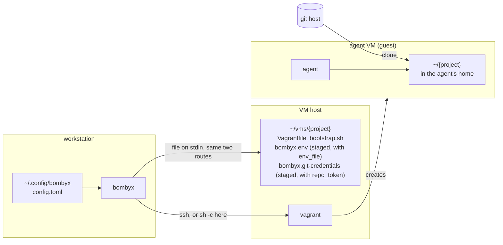
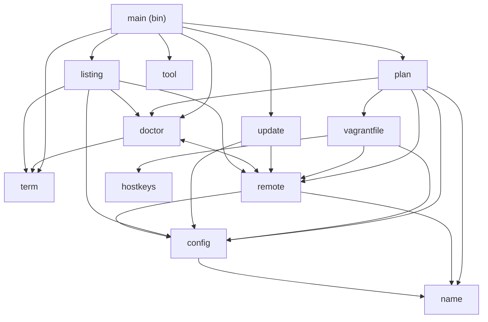
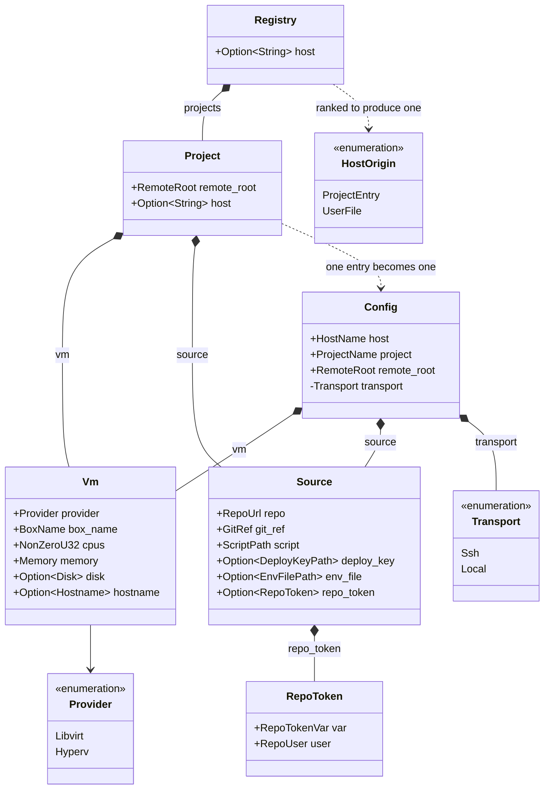
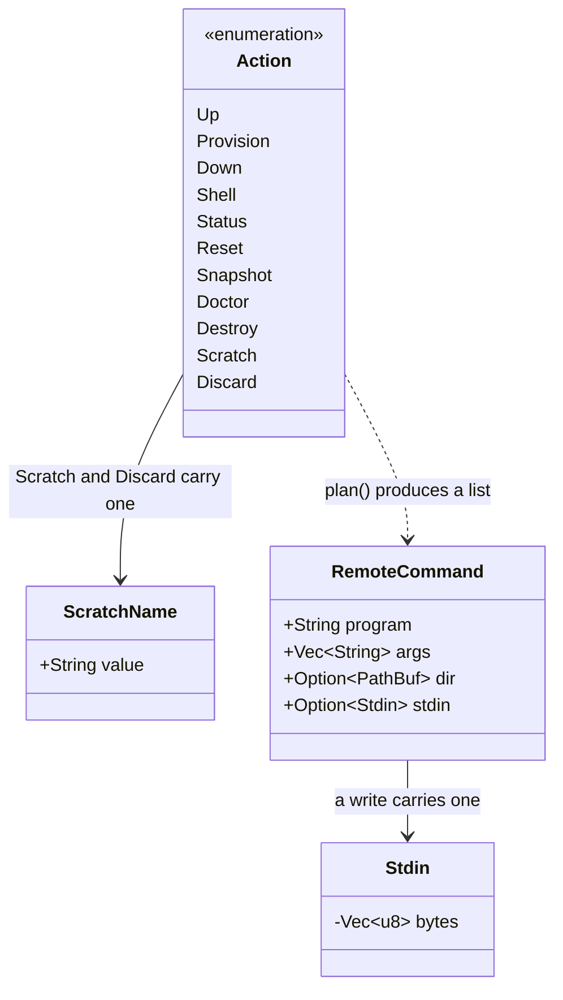
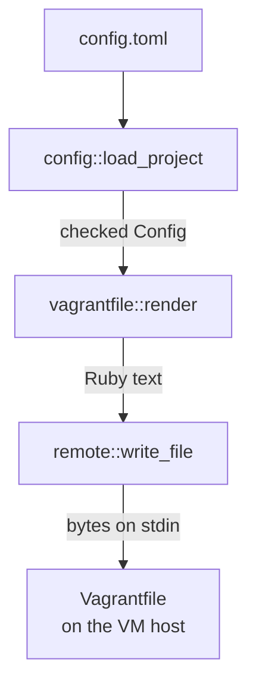

# Architecture

bombyx runs `vagrant` on a VM host -- usually a second machine
reached over SSH -- so an agent runs inside a VM and the
workstation stays clean. bombyx drives `ssh` and `vagrant`; it
does not reimplement either.

This document is the high-level map. Detail lives elsewhere: the
`config` modules and `config.toml.sample` define what each value
may be, `docs/trust-boundary.md` describes the security model, and
`docs/usage.md` covers the operator's view.

## Contents

- [The three machines](#the-three-machines)
- [Library modules](#library-modules)
- [Domain entities](#domain-entities)
- [`bombyx up`, end to end](#bombyx-up-end-to-end)
- [Why three stages and not one](#why-three-stages-and-not-one)
- [Quality gates](#quality-gates)

## The three machines

The workstation never runs project code. The VM host runs
`vagrant` and holds one directory per project. The guest is the
only machine that clones the repository.

**Three roles, not necessarily three machines.** The workstation
can also be the VM host. When bombyx reads `config.toml`, it
compares `host` with this machine's own name. If they match,
bombyx runs the script through `sh -c` locally instead of `ssh`.
The script is identical either way, because `sh -c` starts the
same POSIX shell that `ssh` would start on the host.
`config::transport` performs the comparison. It applies two rules:
the names must match exactly, and Windows never takes the local
route, because it cannot run libvirt. Running the guest on the
workstation still isolates it by kernel and filesystem, but loses
the isolation that depends on the host being a separate machine.

The diagram contains no box for the project's repository, because
neither the workstation nor the VM host reads a file from it; the
guest clones it. The only files that reach the VM host are the two
that bombyx generates and, when configured, a staged `env_file`
and a `repo_token` credential derived from it. bombyx removes both
when the `vagrant` run ends. The workstation reads only
`config.toml`, which is why `--project` names the project instead
of inferring it from the working directory. `docs/trust-boundary.md`
explains the reasoning.

## Library modules

The library holds every module that makes a decision, because
`src/bin/` is excluded from the coverage gate.

`doctor` and `remote` depend on each other: `remote` builds the
probe commands, and `doctor` reads their output. `listing` reuses
`doctor`'s `ProbeResult` instead of declaring its own type.

| Module | Owns |
|--------|------|
| `plan` | which commands run, and in what order |
| `config` | the registry, the `Config` every command reads, and every value's rules (one submodule per checked field) |
| `vagrantfile` | rendering the Vagrantfile and the bootstrap script |
| `hostkeys` | which git hosts publish ssh keys, and where |
| `remote` | building the argv for either route, and quoting |
| `doctor` | preconditions, and what a result means |
| `listing` | grouping by host, reading a reply, the `list` table |
| `update` | `self-update`: download, verify, swap |
| `name` | scratch-VM names and path segments |
| `term` | text reaching the terminal: endings, sanitizing, clipping |
| `tool` | resolving a program, never via the working directory |
| `run` | resolving programs, starting commands, feeding them input |

`main`, in `src/bin/`, parses arguments, drives `run`, and prints.
It starts no process against the VM host itself.

## Domain entities

What a project declares:

`Config` is the value bombyx runs with. `Registry` and `Project`
parse the file it comes from: a file-wide `host`, and one
`[projects.<name>]` table per project holding `remote_root`,
`[vm]`, `[source]`, and an optional `host`. `Config::load_project`
builds one `Config` from one entry. It reads the file once, so a
mid-run edit cannot combine a project host and a file-wide host
that never existed together.

`Config.host` is a `HostName`, the VM host bombyx connects to;
`Vm.hostname` is a `Hostname`, the guest's own name. The two types
are one letter's case apart because they name machines at
different layers, not by accident.

`transport` is the only private field. bombyx derives it from the
winning `host` and this machine's name rather than reading it from
a key, so the machine that runs the commands and the machine that
`destroy` deletes from are always the same one. The other fields
are public but typed, so a value assigned after loading passes the
same check the config file applied. Each value is a newtype whose
constructor holds its rules; the `config` submodules and
`config.toml.sample` define those rules.

What bombyx does with it:

`plan()` turns one `Action` and a `Config` into an ordered
`Vec<RemoteCommand>`. `run` is the only module that starts a
`RemoteCommand`; `plan` and `remote` build commands but run none.
This keeps `--dry-run` accurate and the command order testable.
`Stdin` holds a command's input off the argument list and out of
logs: it has no `Display`, and its `Debug` reports only a length.
`ScratchName` is a one-segment newtype, so a scratch-VM name
cannot escape its directory.

## `bombyx up`, end to end

The order matters in three places. bombyx creates the directory
first, because the two writes redirect into it. `vagrant up` runs
next, because it reads the Vagrantfile those writes produced. The
snapshot is saved last, so it records a machine that has finished
provisioning.

The snapshot step is a single shell script that lists, tests, and
saves on the host. bombyx reads neither the snapshot names nor the
decision. The script saves `fresh-install` only on the first `up`
and leaves later state alone. Each step is one process -- one
`ssh`, or one `sh -c` on the local route -- and bombyx interprets
none of the script. `bombyx provision` is the same sequence ending
in `vagrant provision`, which vagrant runs on demand rather than
only when it creates a machine.

`bootstrap.sh` runs as the unprivileged box user, because the
Vagrantfile marks the provisioner `privileged: false`. The clone
and anything the project installs then land in that account's
home, where the agent looks, rather than in `/root`; a project
that needs root calls `sudo` itself. The `[env]` table may not set
a name that would change what `bootstrap.sh` does. `config/env.rs`
and `config.toml.sample` list those names, and
`docs/trust-boundary.md` describes the isolation model this
arrangement serves.

## Why three stages and not one

Each stage is safe on its own and does not trust the one before
it. `render` escapes every `"`, `\`, and `#` it receives. That
escaping is a precaution: the newtypes already make a quote
unreachable. `write_file` needs no escaping at all, because bytes
sent down a pipe reach the far side without a shell reading them.

## Quality gates

`cargo xtask validate` runs every gate in one pass. The dependency
cooldown runs first, so nothing compiles a too-new crate; the
cheap static gates follow, and the network audit runs last.
`CLAUDE.md` under **Definition of Done** lists the gates in run
order and is the only place that does.
